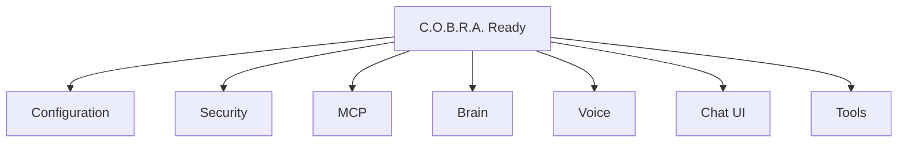

# Component Registry

Canonical list of C.O.B.R.A. components and their startup dependencies.

## Source Mapping

| Source | Reference |
|--------|-----------|
| orchestrator.md | Section 1 (Component Registry) |
| orchestrator-flow.mermaid | `REGISTRY` subgraph `R1`–`R7` |

## Responsibilities

The Orchestrator maintains a registry of all C.O.B.R.A. components:

| Component | Dependencies |
|---|---|
| Configuration | None — loads first |
| Security | Configuration |
| MCP Server Layer | Configuration |
| Brain | Configuration, MCP Server Layer |
| Voice Layer | Configuration, Brain |
| Chat UI | Configuration, Brain, Voice Layer |
| Tools | Brain, MCP Server Layer |
| Orchestrator | None — manages all |

Runtime registry nodes after `READY`:

- `R1` Configuration — healthy
- `R2` Security — healthy
- `R3` MCP Server Layer — healthy
- `R4` Brain — healthy
- `R5` Voice Layer — healthy
- `R6` Chat UI — healthy
- `R7` Tools — healthy

## Inputs / Outputs

| Direction | Content |
|-----------|---------|
| **In** | Component ready/health signals |
| **Out** | Dependency graph for [startup-phases.md](startup-phases.md) and [health-monitoring.md](health-monitoring.md) |

## Flow

## Rules and Constraints

- Orchestrator is not listed as a dependency of others — it manages all.
- Health states updated by [health-monitoring.md](health-monitoring.md).

## Open Items

_None specific to this component._

## Cross-References

- [startup-phases.md](startup-phases.md)
- [health-monitoring.md](health-monitoring.md)
- All component overview specs under `specs/*/`
