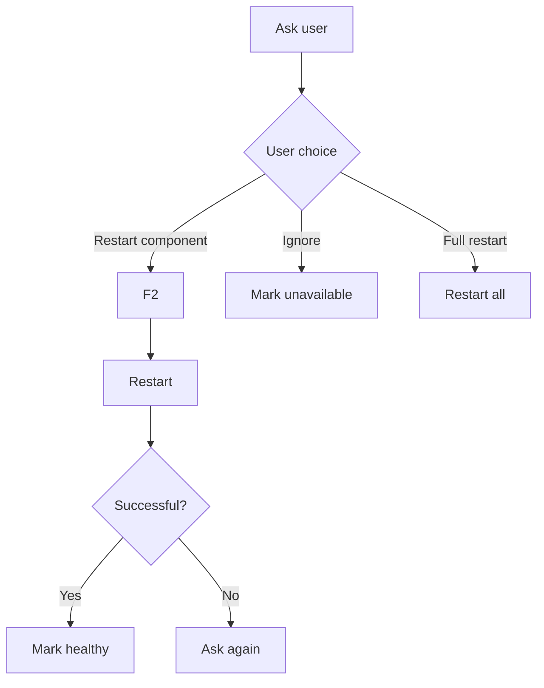

# Failure Response

User-driven handling of component failures — no silent retry.

## Source Mapping

| Source | Reference |
|--------|-----------|
| orchestrator.md | Section 4 (Individual Component Restart), §5 (Failure Policy) |
| orchestrator-flow.mermaid | `FAILURE` subgraph `F1`–`F8`; linked from `H5` |

## Responsibilities

### Individual component restart (§4)

- Any component can be **restarted individually** without full C.O.B.R.A. restart
- On failure: Orchestrator **immediately alerts** and asks what to do
- Options: **Restart this component** / **Ignore for now** / **Restart all of C.O.B.R.A.**
- If user chooses restart: only that component restarts; others continue
- Orchestrator **re-validates** restarted component before marking healthy
- **Dependent components paused** during restart; resume when healthy

### Failure policy (§5)

- On any failure, Orchestrator **immediately asks the user** — **no automatic silent retry**
- User options:
  - **Restart component** — one restart immediately
  - **Ignore for now** — mark unavailable, continue with rest
  - **Restart all of C.O.B.R.A.** — full clean restart
- If restart fails → Orchestrator **asks again** — never silently gives up

Mermaid `FAILURE`:

| Path | Nodes |
|------|-------|
| Restart component | `F1` → `F2` → `F5` → `F6` success? → `F7` healthy / `F8` ask again |
| Ignore | `F3` mark unavailable |
| Full restart | `F4` → `A` launch |

## Inputs / Outputs

| Direction | Content |
|-----------|---------|
| **In** | Health failure from [health-monitoring.md](health-monitoring.md) |
| **Out** | Component restart, ignore, or full relaunch |

## Flow

## Rules and Constraints

- Voice + Chat UI for all failure prompts.
- Restart cooldown undefined (open item).

## Open Items

- [ ] Define whether component restart attempts have a cooldown period

## Cross-References

- [health-monitoring.md](health-monitoring.md)
- [startup-phases.md](startup-phases.md)
- [lifecycle-logging.md](lifecycle-logging.md)
- [specs/chat-ui/approval-prompts.md](../chat-ui/approval-prompts.md)
