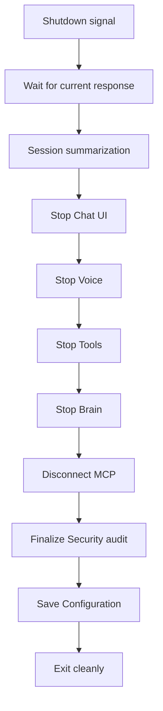

# Graceful Shutdown

Ordered teardown with in-flight response completion and session summarization.

## Source Mapping

| Source | Reference |
|--------|-----------|
| orchestrator.md | Section 7 (Graceful Shutdown) |
| orchestrator-flow.mermaid | `SHUTDOWN` subgraph `SD1`–`SD11` |

## Responsibilities

When the user shuts down C.O.B.R.A.:

1. `SD1` Orchestrator receives shutdown signal
2. `SD2` Waits for C.O.B.R.A. to finish any **response currently in progress**
3. `SD3` Triggers **end-of-session summarization** in the brain (wiki ingest)
4. Stops components in **reverse startup order**:
   - `SD4` Chat UI stops first
   - `SD5` Voice Layer stops
   - `SD6` Tools stops
   - `SD7` Brain stops (completes memory write)
   - `SD8` MCP Server Layer disconnects
   - `SD9` Security finalizes audit log
   - `SD10` Configuration saves state
5. `SD11` Orchestrator exits cleanly — **no data lost**

**No data is lost.** The current session is always summarized before shutdown.

Triggered from `READY` when user initiates shutdown.

## Inputs / Outputs

| Direction | Content |
|-----------|---------|
| **In** | User shutdown command |
| **Out** | Clean process exit; persisted session summary |

## Flow

## Rules and Constraints

- Summarization via [specs/brain/session-summarizer.md](../brain/session-summarizer.md).
- Security audit finalize ties to [specs/security/outbound-audit-log.md](../security/outbound-audit-log.md).

## Open Items

_None specific to this component._

## Cross-References

- [startup-phases.md](startup-phases.md)
- [lifecycle-logging.md](lifecycle-logging.md)
- [specs/brain/session-summarizer.md](../brain/session-summarizer.md)
