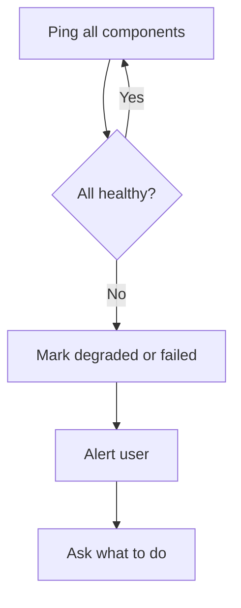

# Health Monitoring

Continuous component health checks with live UI and immediate alerts.

## Source Mapping

| Source | Reference |
|--------|-----------|
| orchestrator.md | Section 3 (Health Monitoring) |
| orchestrator-flow.mermaid | `HEALTH` subgraph `H1`–`H5` |

## Responsibilities

The Orchestrator runs **continuous health checks** on all components:

- Each component exposes a **health endpoint** the Orchestrator pings at a defined interval (`H1`)
- If a component **fails to respond** → Orchestrator marks it **degraded** (`H3`)
- If a component **reports an error** → Orchestrator marks it **failed** (`H3`)
- Health status displayed **live** in Chat UI status panel
- **Any degraded or failed component triggers immediate user alert** — voice + Chat UI (`H4`)

Health states:

- **Healthy** — component responding normally
- **Degraded** — component responding but reporting issues
- **Failed** — component not responding or crashed
- **Restarting** — component is being restarted by the Orchestrator

Mermaid loop:

- `H1` Ping all components at defined interval
- `H2` All healthy? → Yes → `H1`; No → `H3` → `H4` Alert → `H5` Ask user what to do → [failure-response.md](failure-response.md)

## Inputs / Outputs

| Direction | Content |
|-----------|---------|
| **In** | Component health endpoint responses |
| **Out** | Registry health flags; UI/WebSocket updates; user alerts |

## Flow

## Rules and Constraints

- Events logged via [lifecycle-logging.md](lifecycle-logging.md).
- Ping interval and timeout are open items.

## Open Items

- [ ] Define health check ping interval (e.g. every 10 seconds)
- [ ] Define health check timeout before marking a component degraded

## Cross-References

- [failure-response.md](failure-response.md)
- [specs/chat-ui/status-panel.md](../chat-ui/status-panel.md)
- [lifecycle-logging.md](lifecycle-logging.md)
