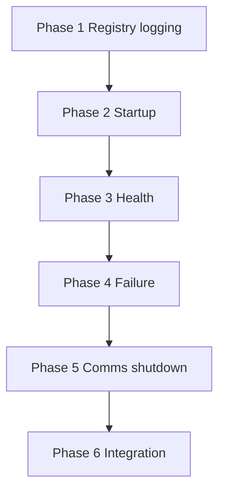

# Orchestrator — Implementation Plan

Phased build order for the C.O.B.R.A. Orchestrator component. Each phase maps to specs in this folder. **No implementation begins without user approval** (per parent [../orchestrator.md](../orchestrator.md)).

---

## Blocking Decisions (orchestrator.md Open Items)

| Open item | Blocks | Owner spec |
|-----------|--------|------------|
| Health check ping interval | Phase 3 health | [health-monitoring.md](health-monitoring.md) |
| Health check timeout | Phase 3 health | [health-monitoring.md](health-monitoring.md) |
| Orchestrator watchdog process | Phase 6 hardening | [orchestrator-overview.md](orchestrator-overview.md) |
| Inter-component comm protocol | Phase 5 comms | [inter-component-communication.md](inter-component-communication.md) |
| Component restart cooldown | Phase 4 failure | [failure-response.md](failure-response.md) |

---

## Phase 1 — Registry and Logging

**Goal:** Component table and lifecycle log file.

| Deliverable | Spec |
|-------------|------|
| Dependency table | [component-registry.md](component-registry.md) |
| `orchestrator.log` events | [lifecycle-logging.md](lifecycle-logging.md) |

**Exit criteria:** Log append on synthetic start/stop events.

---

## Phase 2 — Phased Startup

**Goal:** `A` → phases → `READY` with LM Studio gate.

| Deliverable | Spec |
|-------------|------|
| `PHASE1`–`PHASE4` orchestration | [startup-phases.md](startup-phases.md) |
| Registry population `R1`–`R7` | [component-registry.md](component-registry.md) |

**Exit criteria:** All components start in order; LM Studio wait honored.

---

## Phase 3 — Health Monitoring

**Goal:** Continuous ping loop and UI status feed.

| Deliverable | Spec |
|-------------|------|
| `H1`–`H5` health loop | [health-monitoring.md](health-monitoring.md) |
| Status panel integration | [specs/chat-ui/status-panel.md](../chat-ui/status-panel.md) |

**Exit criteria:** Degraded/failed states visible; alert on failure.

**Blocked by:** ping interval; timeout.

---

## Phase 4 — Failure Response

**Goal:** User-driven restart / ignore / full relaunch.

| Deliverable | Spec |
|-------------|------|
| `F1`–`F8` failure UI flow | [failure-response.md](failure-response.md) |

**Exit criteria:** No silent retry; failed restart re-prompts user.

**Blocked by:** restart cooldown.

---

## Phase 5 — Communication and Shutdown

**Goal:** Event bus and clean teardown.

| Deliverable | Spec |
|-------------|------|
| Publish/route events `C1`–`C3` | [inter-component-communication.md](inter-component-communication.md) |
| `SD1`–`SD11` shutdown | [graceful-shutdown.md](graceful-shutdown.md) |

**Exit criteria:** Pipeline events reach Chat UI; shutdown summarizes session.

**Blocked by:** comm protocol.

---

## Phase 6 — Integration Hardening

**Goal:** Full system lifecycle under orchestrator.

| Deliverable | Spec |
|-------------|------|
| All component init hooks | Each component `implementation-plan.md` |
| Full [../orchestrator-flow.mermaid](../orchestrator-flow.mermaid) | [orchestrator-overview.md](orchestrator-overview.md) |
| Watchdog (if adopted) | [orchestrator-overview.md](orchestrator-overview.md) |

**Exit criteria:** All open items closed or explicitly deferred with user approval.

---

## Dependency Graph

---

## Spec File Checklist

- [component-registry.md](component-registry.md)
- [startup-phases.md](startup-phases.md)
- [health-monitoring.md](health-monitoring.md)
- [failure-response.md](failure-response.md)
- [lifecycle-logging.md](lifecycle-logging.md)
- [graceful-shutdown.md](graceful-shutdown.md)
- [inter-component-communication.md](inter-component-communication.md)
- [orchestrator-overview.md](orchestrator-overview.md)
- [implementation-plan.md](implementation-plan.md)
