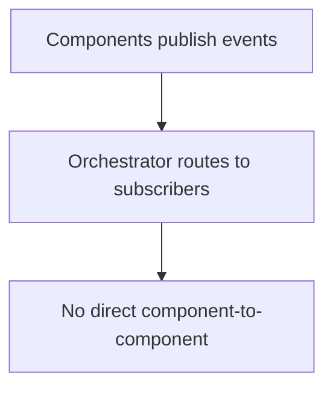

# Inter-Component Communication

Event bus through the Orchestrator — no direct component-to-component calls.

## Source Mapping

| Source | Reference |
|--------|-----------|
| orchestrator.md | Section 8 (Inter-Component Communication) |
| orchestrator-flow.mermaid | `COMMS` subgraph `C1`–`C3`; linked from `READY` |

## Responsibilities

All components communicate **through the Orchestrator** — no component talks directly to another without Orchestrator awareness:

- Components **publish events** to the Orchestrator (e.g. "pipeline step changed", "MCP server went offline") (`C1`)
- Orchestrator **routes events** to relevant subscribers (e.g. Chat UI receives pipeline step updates) (`C2`)
- **No direct component-to-component communication** (`C3`)

Benefits:

- Minimal coupling
- Failures traceable

Examples:

- Brain pipeline step → Chat UI status + inline indicators ([specs/chat-ui/pipeline-indicators.md](../chat-ui/pipeline-indicators.md))
- MCP registry status → Chat UI status panel ([specs/chat-ui/status-panel.md](../chat-ui/status-panel.md))

## Inputs / Outputs

| Direction | Content |
|-----------|---------|
| **In** | Component-published events |
| **Out** | Routed events to subscribers |

## Flow

## Rules and Constraints

- Protocol choice is an open item (message bus, WebSocket, function calls).
- Chat UI WebSocket may be one subscriber transport ([specs/chat-ui/technology-stack.md](../chat-ui/technology-stack.md)).

## Open Items

- [ ] Define inter-component communication protocol (e.g. internal message bus, WebSocket, direct function calls)

## Cross-References

- [specs/chat-ui/technology-stack.md](../chat-ui/technology-stack.md)
- [health-monitoring.md](health-monitoring.md)
- [orchestrator-overview.md](orchestrator-overview.md)
