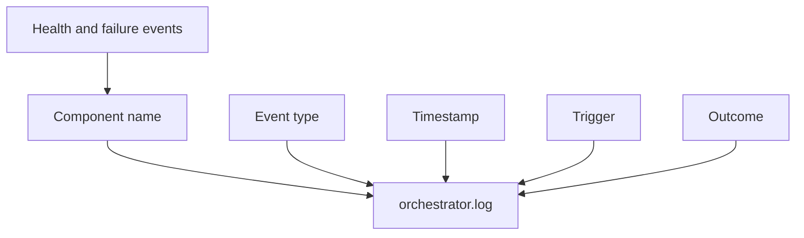

# Lifecycle Logging

Local audit log for all component lifecycle events.

## Source Mapping

| Source | Reference |
|--------|-----------|
| orchestrator.md | Section 6 (Lifecycle Logging) |
| orchestrator-flow.mermaid | `LOG` subgraph `L1`–`L5`; dotted from `HEALTH`, `FAILURE` |

## Responsibilities

Every component lifecycle event is logged in full:

- **Component name** (`L1`)
- **Event type:** Start / Stop / Restart / Degraded / Failed / Recovered (`L2`)
- **Timestamp** (`L3`)
- **Trigger:** Startup / User command / Health check failure / Dependency failure (`L4`)
- **Outcome:** Success / Failure + error message (`L5`)

Storage:

- **`~/.cobra/logs/orchestrator.log`**
- **Local only**, never sent externally

Sources:

- `HEALTH` logs all health transitions
- `FAILURE` logs all failure/restart events

## Inputs / Outputs

| Direction | Content |
|-----------|---------|
| **In** | Lifecycle events from orchestrator and components |
| **Out** | Append-only orchestrator log |

## Flow

## Rules and Constraints

- Complements [specs/security/outbound-audit-log.md](../security/outbound-audit-log.md) (outbound vs. lifecycle).

## Open Items

_None specific to this component._

## Cross-References

- [health-monitoring.md](health-monitoring.md)
- [failure-response.md](failure-response.md)
- [graceful-shutdown.md](graceful-shutdown.md)
