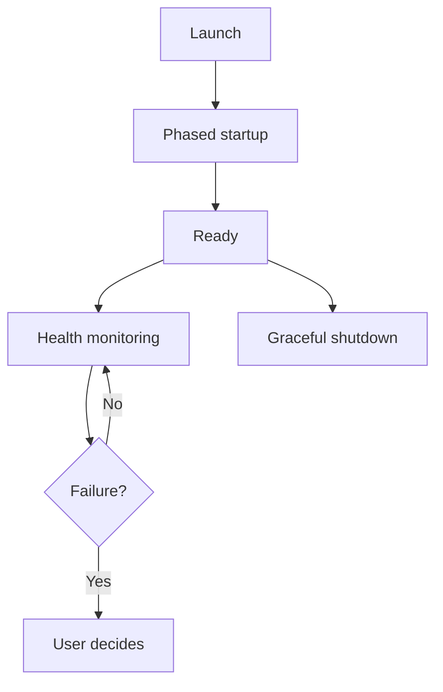

# C.O.B.R.A. Orchestrator — Component Overview

*Cognitive Optimized Brain for Retrieval and Action*

**Status:** Draft  
**Version:** 1.0 (decomposed)  
**Parent sources:** [../orchestrator.md](../orchestrator.md), [../orchestrator-flow.mermaid](../orchestrator-flow.mermaid)  
**Owner:** Damian  

---

## Purpose

The Orchestrator is the **top-level manager** of C.O.B.R.A. It is responsible for starting, stopping, monitoring, and coordinating all components.

It is the **first thing that runs** when C.O.B.R.A. launches and the **last thing that stops** on shutdown. **Every component reports to the Orchestrator.**

---

## High-Level Flow

Authoritative diagram: [../orchestrator-flow.mermaid](../orchestrator-flow.mermaid).

---

## Component Index

| Component | Spec | orchestrator.md | orchestrator-flow.mermaid |
|-----------|------|-----------------|---------------------------|
| Component Registry | [component-registry.md](component-registry.md) | §1 | `REGISTRY` `R1`–`R7` |
| Startup Phases | [startup-phases.md](startup-phases.md) | §2 | `PHASE1`–`PHASE4`, `P1`–`P4B`, `P3C`/`P3D`, `READY` |
| Health Monitoring | [health-monitoring.md](health-monitoring.md) | §3 | `HEALTH` `H1`–`H5` |
| Failure Response | [failure-response.md](failure-response.md) | §4, §5 | `FAILURE` `F1`–`F8` |
| Lifecycle Logging | [lifecycle-logging.md](lifecycle-logging.md) | §6 | `LOG` `L1`–`L5` |
| Graceful Shutdown | [graceful-shutdown.md](graceful-shutdown.md) | §7 | `SHUTDOWN` `SD1`–`SD11` |
| Inter-Component Communication | [inter-component-communication.md](inter-component-communication.md) | §8 | `COMMS` `C1`–`C3` |

**Implementation sequencing:** [implementation-plan.md](implementation-plan.md)

---

## Cross-Cutting Rules

1. **Dependency-ordered startup** — parallel where safe ([startup-phases.md](startup-phases.md)).
2. **LM Studio gate** before brain/tools ([specs/configuration/lm-studio-wait.md](../configuration/lm-studio-wait.md)).
3. **Continuous health pings** — degraded/failed surfaced immediately ([health-monitoring.md](health-monitoring.md)).
4. **No silent retry on failure** — user chooses action ([failure-response.md](failure-response.md)).
5. **Event routing via Orchestrator** — no hidden direct coupling ([inter-component-communication.md](inter-component-communication.md)).
6. **Shutdown summarizes session** then stops in reverse order ([graceful-shutdown.md](graceful-shutdown.md)).
7. **Lifecycle log local only** ([lifecycle-logging.md](lifecycle-logging.md)).

---

## Open Items (from orchestrator.md)

- [ ] Define health check ping interval (e.g. every 10 seconds)
- [ ] Define health check timeout before marking a component degraded
- [ ] Define whether the Orchestrator itself has a watchdog process to restart it if it crashes
- [ ] Define inter-component communication protocol (e.g. internal message bus, WebSocket, direct function calls)
- [ ] Define whether component restart attempts have a cooldown period

Tracked in owner specs and [implementation-plan.md](implementation-plan.md).

---

*Decomposed from orchestrator.md and orchestrator-flow.mermaid. Parent spec remains authoritative; these files add implementable component boundaries.*
