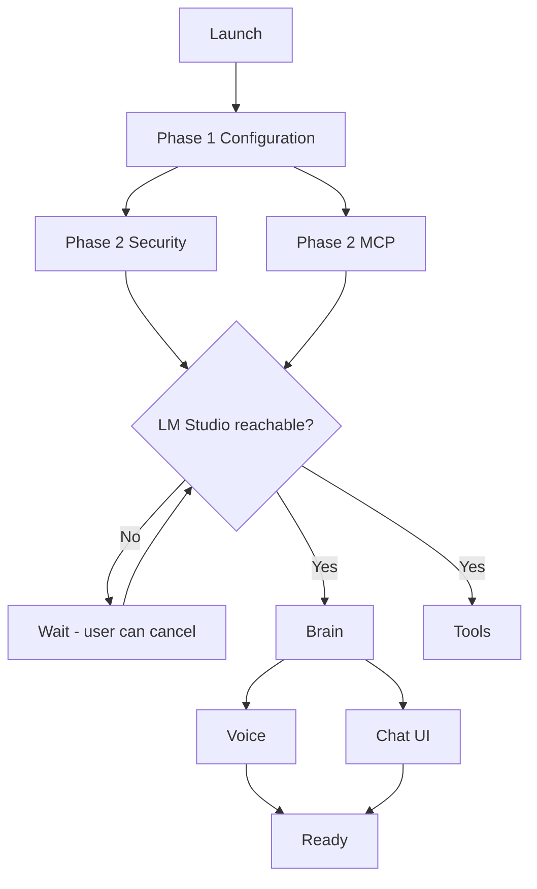

# Startup Phases

Phased parallel component startup with dependency gates and LM Studio wait.

## Source Mapping

| Source | Reference |
|--------|-----------|
| orchestrator.md | Section 2 (Startup — Parallel Where Possible) |
| orchestrator-flow.mermaid | `A`, `PHASE1`–`PHASE4`, `P1`–`P4B`, `P3C`/`P3D`, `READY` |

## Responsibilities

Components start in the **fastest safe order** based on dependencies. Each component signals the Orchestrator when ready. The Orchestrator waits for all dependencies before advancing.

**Phase 1 — No dependencies:**
- Configuration loads and validates (`P1`)

**Phase 2 — Depends on Configuration (parallel):**
- Security initializes (`P2A`)
- MCP Server Layer connects and validates servers (`P2B`)

**Phase 3 — Depends on Phase 2 (parallel):**
- Brain initializes — requires Config + MCP (`P3A`)
- Tools initializes — requires Config + MCP (`P3B`)
- **LM Studio special case** (`P3C`/`P3D`): Orchestrator waits **indefinitely** for LM Studio to become available (per Configuration spec) before Phase 3 begins; user can cancel (`P3D`)

**Phase 4 — Depends on Brain:**
- Voice Layer initializes (`P4A`)
- Chat UI starts local web server (`P4B`)

Result: `READY` — C.O.B.R.A. Ready → populate [component-registry.md](component-registry.md).

## Inputs / Outputs

| Direction | Content |
|-----------|---------|
| **In** | Launch signal `A` |
| **Out** | All components ready; registry healthy |

## Flow

## Rules and Constraints

- LM Studio wait aligns with [specs/configuration/lm-studio-wait.md](../configuration/lm-studio-wait.md).
- No phase advance until dependencies report ready.

## Open Items

_None specific to this component._

## Cross-References

- [component-registry.md](component-registry.md)
- [specs/configuration/startup-flow.md](../configuration/startup-flow.md)
- [specs/mcp-server-layer/startup-validation.md](../mcp-server-layer/startup-validation.md)
