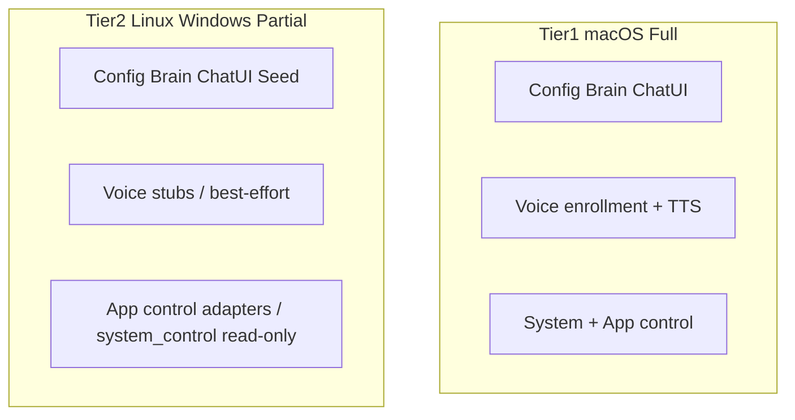

# Platform Support

Cross-cutting specification for operating-system support tiers, path conventions, install expectations, and per-component capability matrices.

## Source Mapping

| Source | Reference |
|--------|-----------|
| configuration.md | Local-first storage, wizard |
| tools/tool-set.md | OS-integrated tools |
| voice/voice-cloning.md | Audio subsystem |
| security/data-protection.md | File permissions |
| onboarding/first-run-sequence.md | Degraded modes |

## 1. Scope and Terminology

**OS platform** — the host operating system (macOS, Linux, Windows). This spec governs OS platform support.

**Communication platform** — third-party messaging services (email, Slack, Discord, etc.). Those are defined in [specs/tools/tool-set.md](tools/tool-set.md) and are unrelated to OS platform tiers.

C.O.B.R.A. is **local-first**: all data stays on the user's machine regardless of OS ([configuration.md](configuration.md)).

**Ownership:** Lead Developer maintains this spec. Component agents supply section content; implementation backlog items name owning agents.

---

## 2. Support Tiers

| Tier | OS | Posture |
|------|-----|---------|
| **Tier 1 — Full** | macOS (Apple Silicon + Intel) | Reference platform; all components including voice enrollment and system control |
| **Tier 2 — Partial** | Linux (x86_64), Windows | Core assistant (config, brain, chat UI, seed/onboarding, portable tools); voice cloning and system integration degraded or unsupported until validated |

### Component matrix

| Component | macOS | Linux | Windows |
|-----------|-------|-------|---------|
| Configuration + wizard | Full | Full | Full |
| Security (bind, audit) | Full | Full | Full |
| Brain + seed/onboarding | Full | Full | Full |
| Chat UI | Full | Full | Full |
| MCP Server Layer | Full | Full | Full |
| Orchestrator | Full | Full | Full |
| Tools — portable (files, calendar, search, drafts, extensibility) | Full | Full | Full |
| Tools — app control | Full | Partial | Partial |
| Tools — system control | Full | Partial (status + volume) | Partial (status + volume) |
| Voice — lifecycle / text paths | Full | Full | Full |
| Voice — cloned TTS + enrollment gate | Full | Partial | Unsupported until E2E validated |

**Legend:** Full = production-ready on that OS · Partial = works with limits or missing deps · Unsupported = not validated; may error or stub



---

## 3. Minimum System Requirements

| Requirement | Minimum | Recommended |
|-------------|---------|-------------|
| Python | 3.9+ | 3.10–3.11 (Coqui TTS compatibility) |
| RAM | 8 GB | 16 GB+ with voice stack |
| Disk | 2 GB free | 10 GB+ (models, voice samples, wiki) |
| LM Studio | Required for full brain pipeline | Same |
| GPU | Not required (CPU-only in current code) | NVIDIA CUDA or Apple Silicon for faster Whisper/TTS |

---

## 4. Data Directory and Path Conventions

**Canonical notation in docs and YAML defaults:** `~/.cobra/`

**Resolved paths at runtime:**

| OS | Resolved root |
|----|---------------|
| macOS | `$HOME/.cobra/` |
| Linux | `$HOME/.cobra/` |
| Windows | `%USERPROFILE%\.cobra\` |

All loaders and validators **must** call `Path.expanduser()` before filesystem operations ([configuration/storage.md](configuration/storage.md)).

Configurable storage paths (`wiki_dir`, `memory_dir`, `logs_dir`, `backups_dir`) accept tilde-prefixed or absolute paths. Forward slashes in YAML are normalized by pathlib on all platforms.

---

## 5. Runtime Dependencies

### Core (all tiers)

Install: `pip install -r requirements.txt`

Includes: pydantic, FastAPI, uvicorn, httpx, pyyaml, pytest.

### Voice extras (Tier 1 full voice; Tier 2 optional)

Install: `pip install -r requirements-voice.txt`

Includes: faster-whisper, sounddevice, openwakeword, TTS (Coqui XTTS).

### Per-OS prerequisites

**macOS (Tier 1 reference):**

```bash
brew install portaudio ffmpeg
pip install -r requirements.txt
pip install -r requirements-voice.txt
```

Grant microphone permission to Terminal, Python, and the browser (localhost Chat UI).

**Linux (Tier 2):**

```bash
sudo apt install -y portaudio19-dev libasound2-dev ffmpeg
pip install -r requirements.txt
pip install -r requirements-voice.txt
```

**Windows (Tier 2):**

```powershell
pip install -r requirements.txt
pip install -r requirements-voice.txt
```

May require Visual C++ Build Tools for native wheels. Cloned TTS enrollment is **unsupported until E2E validated** on Windows.

### LM Studio

Required on all tiers for the full reasoning pipeline. Install per OS from LM Studio documentation; wizard validates reachability ([configuration/lm-studio-wait.md](configuration/lm-studio-wait.md)).

---

## 6. Installation and Launch

**Current model:** Python process started by the user → Orchestrator phased startup → local FastAPI Chat UI → browser at `http://127.0.0.1:<port>/`.

First-run onboarding defers to [onboarding/first-run-sequence.md](onboarding/first-run-sequence.md).

**Open items:** native `.app` bundle, Windows service, systemd unit, tray icon — not specced.

---

## 7. Tools Platform Capability Matrix

### Portable tools (Tier 1 and Tier 2 — Full)

Web Search, File Management, Calendar (local JSON), Communication (draft-only), Code Execution (Python), Extensibility — OS-agnostic via Python/stdlib/HTTP.

### App control (Tier 2 — Partial)

| Operation | macOS | Linux | Windows |
|-----------|-------|-------|---------|
| open (app/url/path) | `open` / `open -a` | `xdg-open` | `cmd /c start` |
| close | `osascript quit` | `pkill -f` | `taskkill /IM` (image name) |
| activate | `osascript activate` | `wmctrl -a` (requires wmctrl) | PowerShell AppActivate |
| list | AppleScript GUI processes | `ps -eo comm=` | `Get-Process` |

### System control

| Operation | macOS | Linux | Windows |
|-----------|-------|-------|---------|
| status / read | Full (volume, brightness, wifi) | Partial (system info only) | Partial (system info only) |
| volume set | Full | Partial (best-effort) | Partial (best-effort) |
| brightness set | Full | Unsupported | Unsupported |
| wifi read | Full | Unsupported | Unsupported |
| notifications | Unsupported (all OS) | Unsupported | Unsupported |
| settings | Unsupported (all OS) | Unsupported | Unsupported |

Non-Darwin mutation before adapters: returns `{status: "unsupported", message: "..."}`.

### Sandbox environment

Sandbox subprocess receives `PATH`, `HOME`/`USERPROFILE`, `PYTHONPATH`, `COBRA_SANDBOX=1` ([tools/sandboxing.md](tools/sandboxing.md)).

---

## 8. Audio and Voice Subsystem

### Optional dependencies

| Package | Purpose | If missing |
|---------|---------|------------|
| sounddevice | Server mic + playback | No server mic loop |
| faster-whisper | Transcription | UTF-8 stub (dev only) |
| openwakeword | Audio wake word | Transcript keyword fallback |
| Coqui TTS | Cloned voice synthesis | Text-only output; onboarding blocked |

### Capture paths

1. **Onboarding enrollment:** browser `MediaRecorder` → Chat UI API → `VoiceCloningManager`. Server transcodes WebM to WAV when possible.
2. **Runtime voice:** server `sounddevice` mic loop (optional; not always orchestrator-wired). Dev path: text-as-speech via `handle_text`.

### Tier posture

| Capability | macOS | Linux | Windows |
|------------|-------|-------|---------|
| Voice lifecycle, interruption, mood proxy | Full | Full | Full |
| Whisper transcription | Full* | Full* | Full* |
| Browser enrollment | Full* | Full* | Partial† |
| Cloned TTS (Coqui XTTS) | Full* | Partial* | Unsupported‡ |
| First-run voice gate | Full* | Partial* | Unsupported‡ |

\* Requires `requirements-voice.txt` + system audio libs  
† Enrollment UI works; validate train/playback on target OS  
‡ Not validated until Windows E2E passes

Enrollment samples are stored locally at `~/.cobra/voice/` (exception to session raw-audio discard — [voice/privacy.md](voice/privacy.md)).

---

## 9. Security and Permissions

### File permissions

| Platform | Behavior |
|----------|----------|
| macOS / Linux | On Security init: user-only `chmod 600` files, `700` directories under C.O.B.R.A. root |
| Windows | NTFS ACLs under user profile; `chmod` is best-effort; user account isolation is the security boundary |

### Network binding

| `security.network_access` | Bind address |
|---------------------------|--------------|
| `localhost_only` (default) | `127.0.0.1` |
| `local_network` | `0.0.0.0` |

IPv4 only. OS firewall rules are the user's responsibility ([security/network-access.md](security/network-access.md)).

### Privacy path redaction

Before audit/log/alert output, redact user-home paths:

- macOS: `/Users/<username>/...`
- Linux: `/home/<username>/...`
- Windows: `C:\Users\<username>\...` (any drive letter)
- Literal `~/` segments

Replacement token: `[home]`.

---

## 10. Degraded and Blocked Modes

Central authority: [onboarding/first-run-sequence.md](onboarding/first-run-sequence.md).

| Condition | Behavior |
|-----------|----------|
| Coqui/XTTS unavailable | Block voice onboarding step; show per-OS install instructions |
| LM Studio down during seed | Block seed step; retain voice progress |
| Tier 2 Windows cloned TTS | Block voice gate until validated or user on Tier 1 macOS |
| Missing sounddevice | Text input + browser enrollment only; no server mic playback |

---

## 11. Implementation Backlog

Tracked here; owning agent implements after spec approval.

| ID | Task | Owner | Phase | Status |
|----|------|-------|-------|--------|
| PS-1 | Cross-platform home-path redaction | security | B1 | Done |
| PS-2 | Windows `USERPROFILE` in sandbox/code exec | tools | B1 | Done |
| PS-3 | Enforce Coqui gate in voice onboarding UI | voice, chat-ui | B1 | Done |
| PS-4 | WebM→WAV enrollment transcoding | voice | B2 | Done |
| PS-5 | Per-OS install/recovery strings in onboarding UI | voice, chat-ui | B2 | Done |
| PS-6 | Windows voice E2E validation checklist | voice | B2 | Done |
| PS-7 | Windows/Linux system_control volume adapters | tools | B3 | Done |
| PS-8 | Windows app_control tests | tools | B3 | Done |
| PS-9 | Remove or implement notifications/settings stubs | tools | B3 | Done (explicit unsupported) |
| PS-10 | CI matrix macOS + ubuntu + windows | Lead Developer | B4 | Done |
| PS-11 | Native launch artifacts (.app, service) | Lead Developer | Future | Open |

### Open items (unresolved)

- [ ] Python version floor in CI
- [ ] Background process when browser tab closes ([chat-ui/application-type.md](chat-ui/application-type.md))
- [ ] GPU/MPS/CUDA acceleration paths for Whisper/TTS
- [ ] ARM Linux / ARM Windows voice stack validation
- [ ] Sandbox technology choice (Docker vs subprocess) per OS ([tools/sandboxing.md](tools/sandboxing.md))

---

## 12. Cross-References

| Component | Defers OS detail to this spec |
|-----------|------------------------------|
| Configuration | Paths, LM Studio install, Python runtime |
| Security | Permissions, bind host, path redaction |
| Tools | App/system control matrix, sandbox env |
| Voice | Audio deps, enrollment tiers, install recovery |
| Chat UI | Browser launch, background lifecycle |
| Orchestrator | Launch entry point, process model |
| Brain | Local-first; hardware/paths defer here |
| Onboarding | Degraded modes, install instructions |

Component specs: [configuration.md](configuration.md), [security.md](security.md), [tools.md](tools.md), [voice.md](voice.md), [chat-ui.md](chat-ui.md), [orchestrator.md](orchestrator.md), [brain.md](brain.md).
