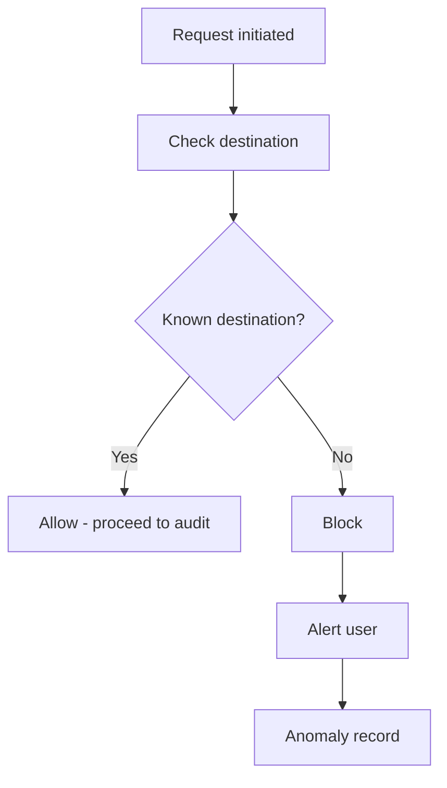

# Anomaly Detection

Block and alert on unexpected outbound connections; allow known destinations.

## Source Mapping

| Source | Reference |
|--------|-----------|
| security.md | Section 6 (Anomaly Detection) |
| security-flow.mermaid | `OUTBOUND` subgraph `OB1`–`OB7`; `KNOWN` `KD1`–`KD4` |

## Responsibilities

C.O.B.R.A. monitors for **unexpected outbound connection attempts** — any connection not initiated by the known pipeline.

Per-request flow (`OUTBOUND`):

1. `OB1` Request initiated by pipeline
2. `OB2` Check destination against known list
3. `OB3` Known destination?
   - **Yes** (Claude, Copilot, MCP, LM Studio) → `OB4` Allow request to proceed → [outbound-audit-log.md](outbound-audit-log.md)
   - **No** → `OB5` Block connection → `OB6` Alert user (voice + Chat UI) → `OB7` Log to anomaly record

On unexpected attempt (§6):

- **Immediately alert** the user in Chat UI and via voice
- Alert includes: what tried to connect, destination, timestamp
- Connection **blocked** and logged in audit log
- C.O.B.R.A. does **not** identify the source — reports observation; user decides

**Known outbound destinations** (not flagged) — `KNOWN` / §6:

| Node | Destination |
|------|-------------|
| `KD1` | Claude API endpoint |
| `KD2` | Copilot API endpoint |
| `KD3` | Configured MCP server endpoints |
| `KD4` | LM Studio local API |

Any other outbound attempt is **unexpected**.

## Inputs / Outputs

| Direction | Content |
|-----------|---------|
| **In** | Outbound connection attempt + destination |
| **Out** | Allow/block; user alert; audit/anomaly log entry |

## Flow

## Rules and Constraints

- Known list must stay in sync with configured MCP endpoints ([specs/mcp-server-layer/config-structure.md](../mcp-server-layer/config-structure.md)).
- Alerts local only ([privacy.md](privacy.md)).

## Open Items

- [ ] Define anomaly detection mechanism (OS-level firewall hooks, network monitor, or application-level intercept)

## Cross-References

- [outbound-audit-log.md](outbound-audit-log.md)
- [privacy.md](privacy.md)
- [specs/chat-ui/chat-panel.md](../chat-ui/chat-panel.md)
- [specs/voice/voice-output.md](../voice/voice-output.md)
