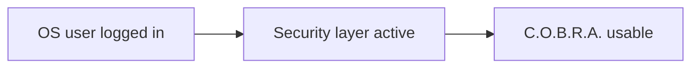

# Authentication

Launch access model — no in-app login; OS-level control only.

## Source Mapping

| Source | Reference |
|--------|-----------|
| security.md | Section 2 (Authentication) |
| security-flow.mermaid | Implicit under `B` Security layer active (no dedicated nodes) |

## Responsibilities

- C.O.B.R.A. **auto-starts without requiring a login or password**.
- **No PIN, password, or biometric** required to launch.
- Access is controlled at the **OS level** — whoever is logged into the machine can use C.O.B.R.A.

## Inputs / Outputs

| Direction | Content |
|-----------|---------|
| **In** | OS user session |
| **Out** | Unauthenticated app launch (by design) |

## Flow

## Rules and Constraints

- Complements [auto-lock.md](auto-lock.md) for in-session inactivity — not launch auth.
- Distinct from optional local network device auth (open item in [network-access.md](network-access.md)).

## Open Items

_None specific to this component._

## Cross-References

- [data-protection.md](data-protection.md)
- [auto-lock.md](auto-lock.md)
- [network-access.md](network-access.md)
