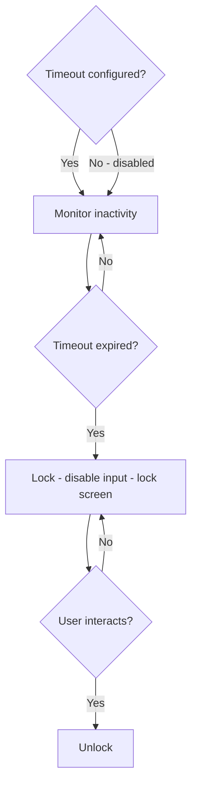

# Auto-Lock

Configurable inactivity lock with UI lock screen and input disable.

## Source Mapping

| Source | Reference |
|--------|-----------|
| security.md | Section 3 (Auto-Lock) |
| security-flow.mermaid | `AUTOLOCK` subgraph `AL1`–`AL6` |

## Responsibilities

- C.O.B.R.A. supports a **configurable auto-lock timeout**.
- When the timeout expires after inactivity, C.O.B.R.A. **locks itself** (`AL4`).
- In locked state:
  - Voice and text input are **disabled**
  - UI displays a **lock screen**
- Unlocking requires the user to **interact with the UI** (click or speak to resume) (`AL5` → `AL6`).
- Timeout is **user-defined** in the config file — no default enforced.
- Auto-lock can be **disabled entirely** by setting timeout to zero.

Config:

```yaml
security:
  auto_lock_timeout_minutes: 0   # 0 = disabled. Set to any value to enable.
```

Mermaid flow:

- `AL1` Auto-lock timeout configured?
- Yes → `AL2` Monitor inactivity → `AL3` Timeout expired?
- No (disabled) → still `AL2` monitor path per diagram
- Expired → `AL4` Lock — disable voice/text, show lock screen
- `AL5` User interacts? → Yes → `AL6` Unlock

## Inputs / Outputs

| Direction | Content |
|-----------|---------|
| **In** | Inactivity timer; `auto_lock_timeout_minutes` from config |
| **Out** | Lock/unlock state to Voice, Chat UI |

## Flow



## Rules and Constraints

- Lock screen rendered in Chat UI ([specs/chat-ui/chat-panel.md](../chat-ui/chat-panel.md)).
- Voice layer must respect disabled input ([specs/voice/wake-word.md](../voice/wake-word.md)).

## Open Items

- [ ] Define behavior when auto-lock triggers mid-response

## Cross-References

- [authentication.md](authentication.md)
- [specs/chat-ui/chat-panel.md](../chat-ui/chat-panel.md)
- [specs/voice/voice-output.md](../voice/voice-output.md)
