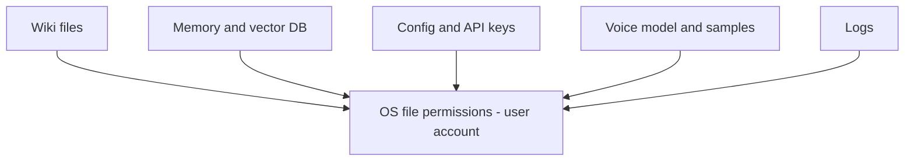

# Data Protection

OS-level protection for all local C.O.B.R.A. data stores.

## Source Mapping

| Source | Reference |
|--------|-----------|
| security.md | Section 1 (Data Protection) |
| security-flow.mermaid | `DATA` subgraph `DP1`–`DP6` |

## Responsibilities

- All local data (wiki, memory, logs, config, voice model) is protected by **OS file permissions**.
- **No additional encryption at rest** is applied.
- Files are owned by the **user's OS account only** — no other system user can access them.
- The user is responsible for OS-level security (machine password, disk encryption if desired).

Protected data categories (`DP1`–`DP5`):

| Node | Data |
|------|------|
| `DP1` | Wiki files |
| `DP2` | Memory and vector DB |
| `DP3` | Config file and API keys |
| `DP4` | Voice model and samples |
| `DP5` | Logs |

All flow to `DP6` — **OS file permissions only, owned by user account**.

## Inputs / Outputs

| Direction | Content |
|-----------|---------|
| **In** | Files created by all C.O.B.R.A. components |
| **Out** | User-account-scoped file access |

## Flow

## Rules and Constraints

- No C.O.B.R.A.-managed encryption layer.
- Security relies on OS account isolation.

## Open Items

_None specific to this component._

## Cross-References

- [authentication.md](authentication.md)
- [outbound-audit-log.md](outbound-audit-log.md)
- [specs/configuration/storage.md](../configuration/storage.md)
