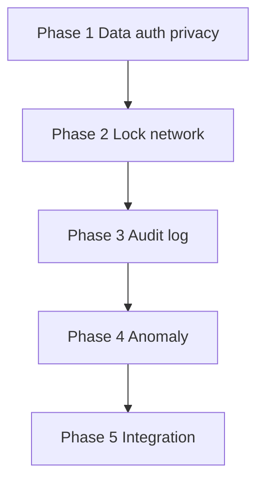

# Security — Implementation Plan

Phased build order for the C.O.B.R.A. Security component. Each phase maps to specs in this folder. **No implementation begins without user approval** (per parent [../security.md](../security.md)).

---

## Blocking Decisions (security.md Open Items)

| Open item | Blocks | Owner spec |
|-----------|--------|------------|
| Anomaly detection mechanism | Phase 4 anomaly | [anomaly-detection.md](anomaly-detection.md) |
| Audit log format | Phase 3 audit | [outbound-audit-log.md](outbound-audit-log.md) |
| Audit log searchable in Chat UI | Phase 3 audit | [outbound-audit-log.md](outbound-audit-log.md) |
| Auto-lock mid-response behavior | Phase 2 auto-lock | [auto-lock.md](auto-lock.md) |
| LAN device authentication | Phase 2 network | [network-access.md](network-access.md) |

---

## Phase 1 — Data, Auth, and Privacy Rules

**Goal:** Establish local-only security baseline.

| Deliverable | Spec |
|-------------|------|
| OS file permissions model | [data-protection.md](data-protection.md) |
| No in-app login | [authentication.md](authentication.md) |
| Privacy hard rules | [privacy.md](privacy.md) |

**Exit criteria:** All data paths documented; no external telemetry.

---

## Phase 2 — Access Control

**Goal:** Auto-lock and network binding.

| Deliverable | Spec |
|-------------|------|
| `AL1`–`AL6` inactivity lock | [auto-lock.md](auto-lock.md) |
| `NW1`–`NW4` bind modes | [network-access.md](network-access.md) |
| Chat UI lock screen | [specs/chat-ui/chat-panel.md](../chat-ui/chat-panel.md) |

**Exit criteria:** Lock disables input; server binds per config.

**Blocked by:** mid-response lock; LAN auth.

---

## Phase 3 — Outbound Audit Log

**Goal:** Log every allowed outbound request.

| Deliverable | Spec |
|-------------|------|
| `AU1`–`AU7` audit fields | [outbound-audit-log.md](outbound-audit-log.md) |
| `~/.cobra/logs/outbound-audit.log` | [outbound-audit-log.md](outbound-audit-log.md) |

**Exit criteria:** Pipeline requests append sanitized audit rows.

**Blocked by:** log format; Chat UI search.

---

## Phase 4 — Anomaly Detection

**Goal:** Allowlist known destinations; block and alert on others.

| Deliverable | Spec |
|-------------|------|
| `OB1`–`OB7` outbound gate | [anomaly-detection.md](anomaly-detection.md) |
| `KD1`–`KD4` known list | [anomaly-detection.md](anomaly-detection.md) |

**Exit criteria:** Unexpected connection blocked; user alerted voice + UI.

**Blocked by:** detection mechanism.

---

## Phase 5 — Integration Hardening

**Goal:** Wire security across orchestrator startup and all outbound components.

| Deliverable | Spec |
|-------------|------|
| Orchestrator Phase 2 Security init | [specs/orchestrator/startup-phases.md](../orchestrator/startup-phases.md) |
| MCP/tools/brain outbound hooks | Component logging specs |
| Full [../security-flow.mermaid](../security-flow.mermaid) | [security-overview.md](security-overview.md) |

**Exit criteria:** All open items closed or explicitly deferred with user approval.

---

## Dependency Graph

---

## Spec File Checklist

- [data-protection.md](data-protection.md)
- [authentication.md](authentication.md)
- [auto-lock.md](auto-lock.md)
- [outbound-audit-log.md](outbound-audit-log.md)
- [network-access.md](network-access.md)
- [anomaly-detection.md](anomaly-detection.md)
- [privacy.md](privacy.md)
- [security-overview.md](security-overview.md)
- [implementation-plan.md](implementation-plan.md)
