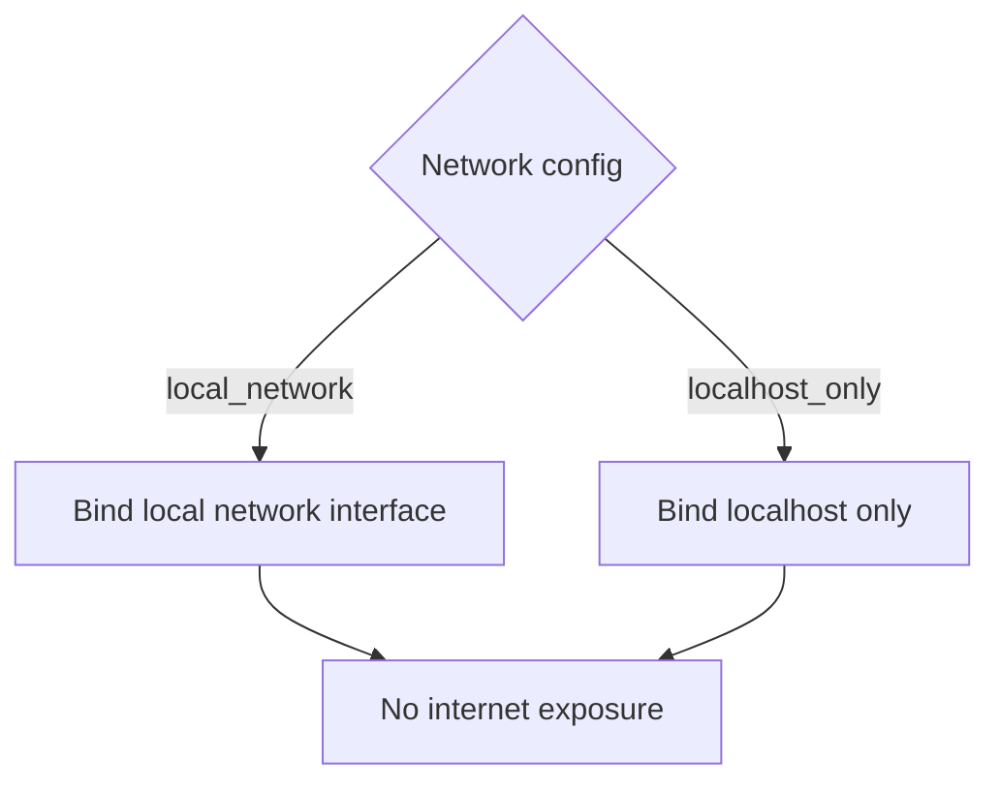

# Network Access

Local web server binding — home network vs localhost-only.

## Source Mapping

| Source | Reference |
|--------|-----------|
| security.md | Section 5 (Network Access) |
| security-flow.mermaid | `NETWORK` subgraph `NW1`–`NW4` |

## Responsibilities

- C.O.B.R.A. is accessible from **any device on the user's local home network** (when configured).
- The local web server binds to the **local network interface** (not just localhost).
- **No internet exposure** — C.O.B.R.A. is not accessible from outside the home network (`NW4`).
- Network access can be restricted to **localhost only** via config if preferred.

Config:

```yaml
security:
  network_access: local_network   # Options: localhost_only, local_network
```

Mermaid:

- `NW1` Network config
- `local_network` → `NW2` Bind to local network interface — all home devices can connect
- `localhost_only` → `NW3` Bind to localhost only — this machine only
- Both → `NW4` No internet exposure

## Inputs / Outputs

| Direction | Content |
|-----------|---------|
| **In** | `network_access` from config |
| **Out** | Server bind address for Chat UI ([specs/chat-ui/application-type.md](../chat-ui/application-type.md)) |

## Flow



## Rules and Constraints

- Chat UI local server must respect binding ([specs/chat-ui/technology-stack.md](../chat-ui/technology-stack.md)).
- Not a substitute for home router/firewall security.

## Open Items

- [ ] Define whether local network access requires any authentication from other devices

## Cross-References

- [specs/chat-ui/application-type.md](../chat-ui/application-type.md)
- [authentication.md](authentication.md)
- [anomaly-detection.md](anomaly-detection.md)
- [../platform-support.md](../platform-support.md) — bind host per OS
