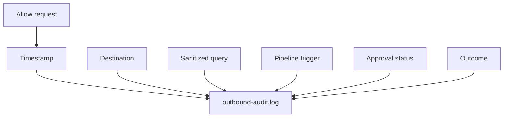

# Outbound Audit Log

Full local audit trail for every outbound request C.O.B.R.A. makes.

## Source Mapping

| Source | Reference |
|--------|-----------|
| security.md | Section 4 (Outbound Request Audit Log) |
| security-flow.mermaid | `AUDIT` subgraph `AU1`–`AU7`; fed by `OB4` allow path |

## Responsibilities

Every outbound request made by C.O.B.R.A. is logged in full:

| Field | Description |
|---|---|
| Timestamp | When the request was made (`AU1`) |
| Destination | API or server called — Claude API, Copilot, MCP server name (`AU2`) |
| Sanitized query | What was sent — topic only, never personal data (`AU3`) |
| Trigger | Which pipeline step initiated the request (`AU4`) |
| Approval status | Approved / Denied / Auto (read-only tool) (`AU5`) |
| Outcome | Success / Failure / Timeout (`AU6`) |

Storage (`AU7`):

- Audit log stored locally at **`~/.cobra/logs/outbound-audit.log`**
- **Never sent externally**
- Viewable in the Chat UI (**future:** audit log panel)
- **Retained indefinitely** — user can clear manually

Logged after [anomaly-detection.md](anomaly-detection.md) allows request (`OB4` → `AUDIT`).

## Inputs / Outputs

| Direction | Content |
|-----------|---------|
| **In** | Allowed outbound request metadata from pipelines |
| **Out** | Append-only local log file |

## Flow

## Rules and Constraints

- Sanitized queries only ([privacy.md](privacy.md)).
- Blocked anomaly attempts also logged via anomaly path ([anomaly-detection.md](anomaly-detection.md)).

## Open Items

- [ ] Define audit log format (plain text, JSON, or structured log)
- [ ] Define whether the audit log is searchable from the Chat UI

## Cross-References

- [anomaly-detection.md](anomaly-detection.md)
- [privacy.md](privacy.md)
- [specs/mcp-server-layer/logging.md](../mcp-server-layer/logging.md)
- [specs/tools/tool-memory.md](../tools/tool-memory.md)
