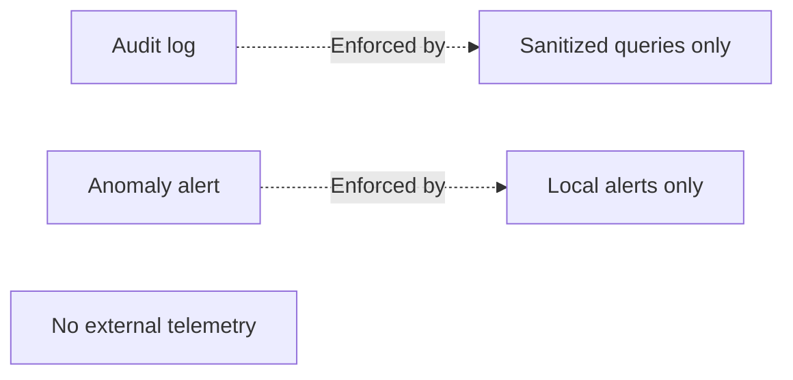

# Privacy

Security enforcement of the master privacy rule for logs and alerts.

## Source Mapping

| Source | Reference |
|--------|-----------|
| security.md | Section 7 (Privacy — Hard Rule) |
| security-flow.mermaid | `PRIVACY` subgraph `PR1`–`PR3`; enforced on `AUDIT`, `OB6` |

## Responsibilities

All security mechanisms enforce the **master privacy rule**:

- **Audit logs contain sanitized queries only** — never raw personal data (`PR1`)
- **No security telemetry is sent externally** (`PR2`)
- **Anomaly alerts are displayed locally only** (`PR3`)

Enforcement points:

- `AUDIT` outbound audit log
- `OB6` anomaly user alert

## Inputs / Outputs

| Direction | Content |
|-----------|---------|
| **In** | Raw request/alert payloads |
| **Out** | Sanitized, local-only security records |

## Flow

## Rules and Constraints

- Aligns with brain, tools, and MCP privacy specs.
- No cloud security vendor integration.

## Open Items

_None specific to this component._

## Cross-References

- [outbound-audit-log.md](outbound-audit-log.md)
- [anomaly-detection.md](anomaly-detection.md)
- [specs/brain/privacy.md](../brain/privacy.md)
- [specs/mcp-server-layer/privacy.md](../mcp-server-layer/privacy.md)
