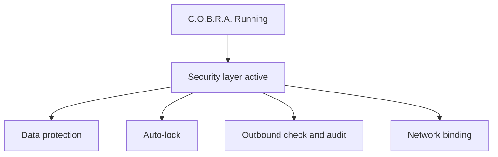

# C.O.B.R.A. Security — Component Overview

*Cognitive Optimized Brain for Retrieval and Action*

**Status:** Draft  
**Version:** 1.0 (decomposed)  
**Parent sources:** [../security.md](../security.md), [../security-flow.mermaid](../security-flow.mermaid)  
**Owner:** Damian  

---

## Purpose

The Security component defines how C.O.B.R.A. protects local data, controls access, monitors outbound activity, and alerts on anomalies.

**Security is enforced locally — no cloud service is used for any security function.**

---

## High-Level Flow

Authoritative diagram: [../security-flow.mermaid](../security-flow.mermaid).

---

## Component Index

| Component | Spec | security.md | security-flow.mermaid |
|-----------|------|-------------|----------------------|
| Data Protection | [data-protection.md](data-protection.md) | §1 | `DATA` `DP1`–`DP6` |
| Authentication | [authentication.md](authentication.md) | §2 | Implicit `B` |
| Auto-Lock | [auto-lock.md](auto-lock.md) | §3 | `AUTOLOCK` `AL1`–`AL6` |
| Outbound Audit Log | [outbound-audit-log.md](outbound-audit-log.md) | §4 | `AUDIT` `AU1`–`AU7` |
| Network Access | [network-access.md](network-access.md) | §5 | `NETWORK` `NW1`–`NW4` |
| Anomaly Detection | [anomaly-detection.md](anomaly-detection.md) | §6 | `OUTBOUND` `OB1`–`OB7`, `KNOWN` |
| Privacy | [privacy.md](privacy.md) | §7 | `PRIVACY` `PR1`–`PR3` |

**Implementation sequencing:** [implementation-plan.md](implementation-plan.md)

---

## Cross-Cutting Rules

1. **OS permissions only** for data at rest ([data-protection.md](data-protection.md)).
2. **No app login** — OS session controls access ([authentication.md](authentication.md)).
3. **Configurable auto-lock** — optional inactivity lock ([auto-lock.md](auto-lock.md)).
4. **Every outbound request audited** — sanitized, local log ([outbound-audit-log.md](outbound-audit-log.md)).
5. **Known destinations allowlisted** — all else blocked and alerted ([anomaly-detection.md](anomaly-detection.md)).
6. **No external security telemetry** ([privacy.md](privacy.md)).

---

## Open Items (from security.md)

- [ ] Define anomaly detection mechanism (OS-level firewall hooks, network monitor, or application-level intercept)
- [ ] Define audit log format (plain text, JSON, or structured log)
- [ ] Define whether the audit log is searchable from the Chat UI
- [ ] Define behavior when auto-lock triggers mid-response
- [ ] Define whether local network access requires any authentication from other devices

Tracked in owner specs and [implementation-plan.md](implementation-plan.md).

---

*Decomposed from security.md and security-flow.mermaid. Parent spec remains authoritative; these files add implementable component boundaries.*
