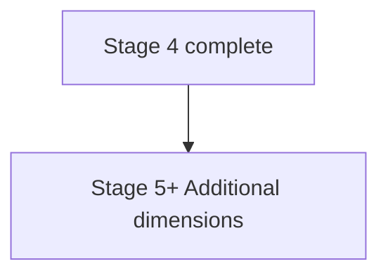

# Additional Dimensions

Stage 5+ personality dimensions captured after priority stages.

## Source Mapping

| Source | Reference |
|--------|-----------|
| seed-document.md | Section 4 (Additional Dimensions — Captured in Later Stages) |
| seed-document-flow.mermaid | `STAGES` `S5` |

## Responsibilities

After the four priority stages, subsequent sessions capture:

- Context-specific behavior (professional vs. casual vs. close relationships)
- How you like to receive feedback
- Your relationship with failure
- Your energy patterns (when you're most productive, what drains you)
- Your opinions on topics you frequently discuss
- Habits and routines that define your day

Stored under **Context-Specific Behavior** and related sections in [output-format.md](output-format.md).

## Inputs / Outputs

| Direction | Content |
|-----------|---------|
| **In** | User answers via staged interview |
| **Out** | Wiki sections beyond priority four |

## Flow

## Rules and Constraints

- Optional for MVP readiness until policy defined ([minimum-viable-seed.md](minimum-viable-seed.md)).
- Same interview flow as priority stages ([interview-session-flow.md](interview-session-flow.md)).

## Open Items

- [ ] Define the exact question set for each stage (to be done collaboratively with Claude)

## Cross-References

- [priority-dimensions.md](priority-dimensions.md)
- [interview-stages.md](interview-stages.md)
- [output-format.md](output-format.md)
