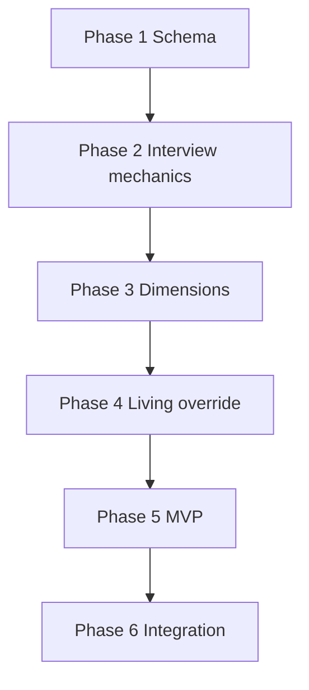

# Seed Document — Implementation Plan

Phased build order for the C.O.B.R.A. Seed Document component. Each phase maps to specs in this folder. **No implementation begins without user approval** (per parent [../seed-document.md](../seed-document.md)).

---

## Blocking Decisions (seed-document.md Open Items)

| Open item | Status |
|-----------|--------|
| Exact question set per stage | **Closed** — verbatim from priority/additional dimension specs |
| Minimum viable stage count | **Closed** — MVP = stages 1–4 |
| Prompt frequency for remaining stages | **Closed** — once per calendar day (MV3) |
| Export for backup | **Closed** — `GET /api/seed/export` |
| PE2 ongoing interviews | **Closed** — refresh interviews per dimension |

---

## Phase 1 — Schema and Purpose

**Goal:** `you.md` structure and personality bootstrap rationale.

| Deliverable | Spec |
|-------------|------|
| Three functions of seed doc | [purpose.md](purpose.md) |
| Markdown template | [output-format.md](output-format.md) |

**Exit criteria:** Empty `you.md` can be created with correct headings.

**Blocked by:** export format (optional).

---

## Phase 2 — Interview Mechanics

**Goal:** Staged entry, resume, and per-stage conversation loop.

| Deliverable | Spec |
|-------------|------|
| Staged approach | [interview-approach.md](interview-approach.md) |
| `A`–`D`, `S1`–`S5` sequencing | [interview-stages.md](interview-stages.md) |
| `I1`–`I12` flow | [interview-session-flow.md](interview-session-flow.md) |

**Exit criteria:** One stage can run start-to-store in chat.

---

## Phase 3 — Dimension Content

**Goal:** Priority and additional question sets.

| Deliverable | Spec |
|-------------|------|
| Stages 1–4 questions | [priority-dimensions.md](priority-dimensions.md) |
| Stage 5+ topics | [additional-dimensions.md](additional-dimensions.md) |

**Exit criteria:** All parent questions available to interviewer logic.

**Blocked by:** collaborative question refinement.

---

## Phase 4 — Living Document and Override

**Goal:** Auto-updates and user authority.

| Deliverable | Spec |
|-------------|------|
| `LV1`–`LV5` updates | [living-document.md](living-document.md) |
| `OV1`–`OV5` override | [user-override.md](user-override.md) |
| Wiki version history | [output-format.md](output-format.md) |

**Exit criteria:** Contradiction reconciliation; override wins.

---

## Phase 5 — MVP Gate and Brain Integration

**Goal:** Personality active after stages 1–4; brain You page wired.

| Deliverable | Spec |
|-------------|------|
| `MV1`–`MV3` readiness | [minimum-viable-seed.md](minimum-viable-seed.md) |
| Personality model `PE1` | [specs/brain/personality-model.md](../brain/personality-model.md) |

**Exit criteria:** C.O.B.R.A. usable after MVP; prompts for incomplete stages.

**Status:** Complete (2026-06-06 PASS review).

---

## Phase 6 — Integration Hardening

**Goal:** Full [../seed-document-flow.mermaid](../seed-document-flow.mermaid) path.

| Deliverable | Spec |
|-------------|------|
| Wiki browser review | [specs/chat-ui/wiki-browser-panel.md](../chat-ui/wiki-browser-panel.md) |
| First-launch orchestration | [specs/orchestrator/startup-phases.md](../orchestrator/startup-phases.md) |

**Exit criteria:** All open items closed or explicitly deferred with user approval.

---

## Dependency Graph

---

## Spec File Checklist

- [purpose.md](purpose.md)
- [interview-approach.md](interview-approach.md)
- [priority-dimensions.md](priority-dimensions.md)
- [additional-dimensions.md](additional-dimensions.md)
- [interview-stages.md](interview-stages.md)
- [interview-session-flow.md](interview-session-flow.md)
- [output-format.md](output-format.md)
- [living-document.md](living-document.md)
- [user-override.md](user-override.md)
- [minimum-viable-seed.md](minimum-viable-seed.md)
- [seed-document-overview.md](seed-document-overview.md)
- [implementation-plan.md](implementation-plan.md)
