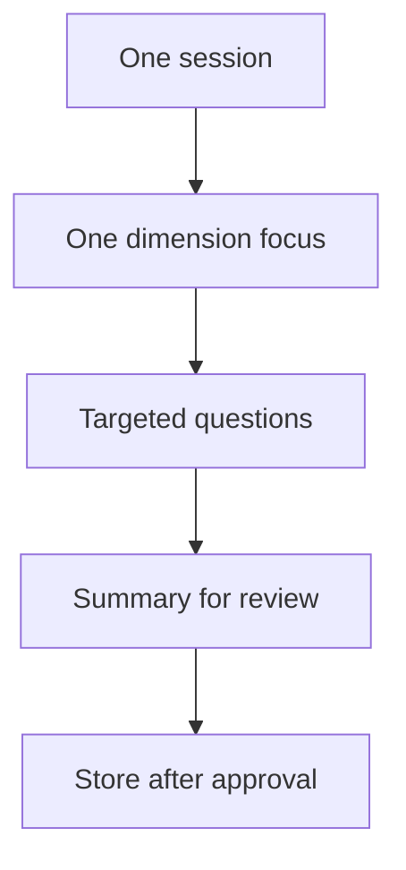

# Interview Approach

Staged personality interviews to avoid fatigue and improve accuracy.

## Source Mapping

| Source | Reference |
|--------|-----------|
| seed-document.md | Section 2 (Interview Approach) |
| seed-document-flow.mermaid | Rationale for `STAGES` one per session |

## Responsibilities

- The interview is conducted in **stages** — a few personality dimensions per session.
- This avoids fatigue and allows **thoughtful, accurate answers** rather than rushed ones.
- Each stage is a **structured conversation** where C.O.B.R.A.:
  - Asks targeted questions
  - Listens to answers
  - Summarizes what it learned for the user to **review and correct** before storing

## Inputs / Outputs

| Direction | Content |
|-----------|---------|
| **In** | User availability per session |
| **Out** | One dimension completed per stage session |

## Flow

## Rules and Constraints

- One dimension focus per session aligns with [interview-stages.md](interview-stages.md).
- Per-exchange rules in [interview-session-flow.md](interview-session-flow.md).

## Open Items

_None specific to this component._

## Cross-References

- [interview-stages.md](interview-stages.md)
- [interview-session-flow.md](interview-session-flow.md)
- [priority-dimensions.md](priority-dimensions.md)
