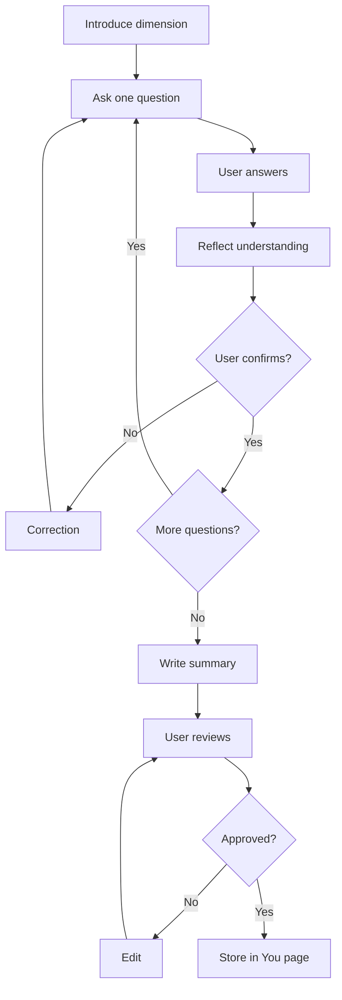

# Interview Session Flow

Per-stage conversation structure — one question per exchange, confirm, then summarize.

## Source Mapping

| Source | Reference |
|--------|-----------|
| seed-document.md | Section 7 (Interview Session Flow) |
| seed-document-flow.mermaid | `INTERVIEW` subgraph `I1`–`I12` |

## Responsibilities

Each stage follows this structure (§7):

1. C.O.B.R.A. introduces the dimension being covered (`I1`)
2. C.O.B.R.A. asks questions **one at a time** — never more than one question per exchange (`I2`)
3. User answers in their own words (`I3`)
4. C.O.B.R.A. reflects back what it understood and asks for confirmation (`I4` → `I5`)
5. User corrects or confirms (`I5` → No → `I6` rephrase → `I2`; Yes → `I7`)
6. At end of stage, C.O.B.R.A. writes a summary of the dimension (`I8`)
7. User reviews the summary and approves or edits before it is stored (`I9` → `I10`)

Mermaid detail:

- `I7` More questions in stage? → Yes → `I2`; No → `I8`
- `I10` Summary approved? → No → `I11` Edit and rewrite → `I9`; Yes → `I12` Store dimension in You wiki page

## Inputs / Outputs

| Direction | Content |
|-----------|---------|
| **In** | User natural-language answers |
| **Out** | Approved dimension summary → [output-format.md](output-format.md) |

## Flow

## Rules and Constraints

- Never batch multiple questions in one turn.
- Storage only after explicit summary approval.

## Open Items

_None specific to this component._

## Cross-References

- [interview-stages.md](interview-stages.md)
- [output-format.md](output-format.md)
- [user-override.md](user-override.md)
