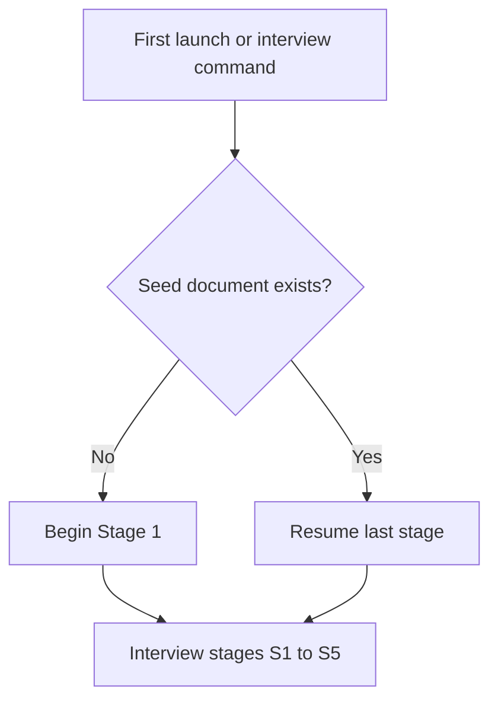

# Interview Stages

Entry, resume, and sequencing across staged interview sessions.

## Source Mapping

| Source | Reference |
|--------|-----------|
| seed-document.md | Implied first-launch / resume behavior (Overview, §2) |
| seed-document-flow.mermaid | `A`, `B`, `C`, `D`; `STAGES` `S1`–`S5` |

## Responsibilities

**Entry (`A`–`D`):**

- `A` — First Launch or Interview Command
- `B` — Seed document exists?
  - **No** → `C` Begin Stage 1 interview
  - **Yes** → `D` Resume from last completed stage

**Stage sequence (`STAGES`):**

| Node | Stage |
|------|-------|
| `S1` | Stage 1 — Communication Style and Tone |
| `S2` | Stage 2 — Decision-Making Patterns |
| `S3` | Stage 3 — Values and Beliefs |
| `S4` | Stage 4 — Humor and Personality Quirks |
| `S5` | Stage 5+ — Additional dimensions |

`S1` → `S2` → `S3` → `S4` → `S5`

Each stage runs [interview-session-flow.md](interview-session-flow.md) before advancing.

## Inputs / Outputs

| Direction | Content |
|-----------|---------|
| **In** | Interview command; existing `you.md` progress |
| **Out** | Next stage to run |

## Flow

## Rules and Constraints

- Resume must not skip unapproved summaries.
- MVP gate after stage storage ([minimum-viable-seed.md](minimum-viable-seed.md)).

## Open Items

- [ ] Define how often C.O.B.R.A. prompts the user to complete remaining stages

## Cross-References

- [interview-session-flow.md](interview-session-flow.md)
- [minimum-viable-seed.md](minimum-viable-seed.md)
- [priority-dimensions.md](priority-dimensions.md)
