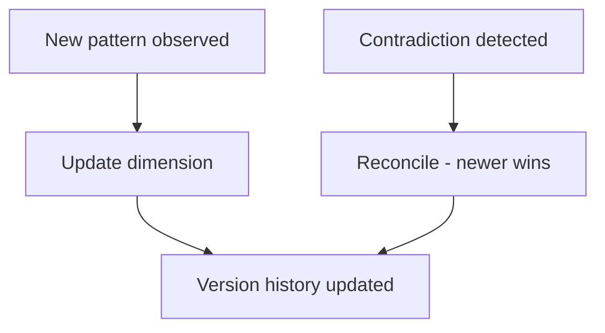

# Living Document

Automatic updates to the seed document as C.O.B.R.A. learns from sessions.

## Source Mapping

| Source | Reference |
|--------|-----------|
| seed-document.md | Section 5 (Living Document — automatic update bullets) |
| seed-document-flow.mermaid | `LIVING` subgraph `LV1`–`LV5` |

## Responsibilities

The seed document is **not static**. C.O.B.R.A. updates it automatically as it learns through interactions:

- **New behavioral patterns** observed during sessions update the relevant dimensions (`LV1` → `LV2`)
- **Contradictions** between current behavior and the seed document are noted and reconciled (`LV3` → `LV4` — newer observation wins)
- The **"You" wiki page version history** tracks all changes over time (`LV5`, `W7`)
- The user can **review** the current seed document at any time in the wiki browser

Manual correct/override is specified in [user-override.md](user-override.md).

Mermaid:

- `LV1` New behavioral pattern observed
- `LV2` C.O.B.R.A. updates relevant dimension
- `LV3` Contradiction detected
- `LV4` Reconcile — newer observation wins
- `LV5` Version history updated

`WIKI` ↔ `LIVING` bidirectional updates.

## Inputs / Outputs

| Direction | Content |
|-----------|---------|
| **In** | Session behavioral signals from brain |
| **Out** | Updated `you.md` sections + version history |

## Flow

## Rules and Constraints

- Reconciliation policy: newer observation wins unless user overrides ([user-override.md](user-override.md)).
- Feeds [specs/brain/personality-model.md](../brain/personality-model.md) `PE3` behavioral logging.

## Open Items

_None specific to this component._

## Cross-References

- [output-format.md](output-format.md)
- [user-override.md](user-override.md)
- [specs/brain/personality-model.md](../brain/personality-model.md)
