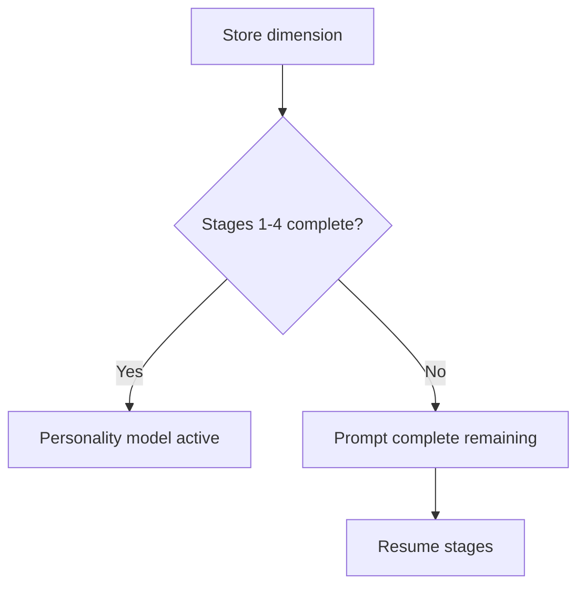

# Minimum Viable Seed

Readiness gate — when the personality model becomes active vs. prompts to continue.

## Source Mapping

| Source | Reference |
|--------|-----------|
| seed-document.md | Implied readiness (Overview; open item on minimum stages) |
| seed-document-flow.mermaid | `MVP` subgraph `MV1`–`MV3` |

## Responsibilities

After each `I12` store dimension:

- `MV1` — Stages 1–4 complete?
  - **Yes** → `MV2` C.O.B.R.A. personality model active
  - **No** → `MV3` C.O.B.R.A. prompts to complete remaining stages → `STAGES`

Aligns with [purpose.md](purpose.md) bootstrap goal and [specs/brain/personality-model.md](../brain/personality-model.md).

Parent open items owned here:

- Minimum number of stages before C.O.B.R.A. is ready to use
- How often to prompt for remaining stages

## Inputs / Outputs

| Direction | Content |
|-----------|---------|
| **In** | Completed stage count |
| **Out** | Personality active flag; continuation prompts |

## Flow

## Rules and Constraints

- Stages 1–4 map to [priority-dimensions.md](priority-dimensions.md).
- Stage 5+ optional for full profile but MVP focuses on `S1`–`S4`.

## Open Items

- [ ] Define minimum viable seed document — what is the minimum number of stages before C.O.B.R.A. is ready to use
- [ ] Define how often C.O.B.R.A. prompts the user to complete remaining stages

## Cross-References

- [purpose.md](purpose.md)
- [interview-stages.md](interview-stages.md)
- [specs/brain/personality-model.md](../brain/personality-model.md)
