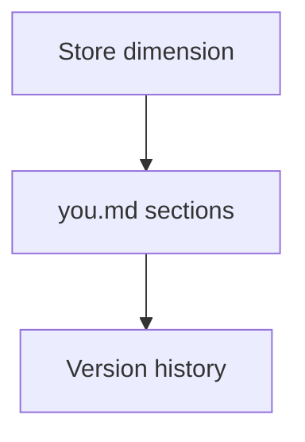

# Output Format

You wiki page schema and storage path for the seed document.

## Source Mapping

| Source | Reference |
|--------|-----------|
| seed-document.md | Section 6 (Output Format) |
| seed-document-flow.mermaid | `WIKI` subgraph `W1`–`W7` |

## Responsibilities

The seed document is stored as the **"You" wiki page** at **`~/.cobra/wiki/you.md`** using this structure:

```markdown
# You
*Last updated: [date]*

## Communication Style
[C.O.B.R.A.-generated summary from Stage 1 interview]

## Decision-Making
[C.O.B.R.A.-generated summary from Stage 2 interview]

## Values and Beliefs
[C.O.B.R.A.-generated summary from Stage 3 interview]

## Humor and Personality
[C.O.B.R.A.-generated summary from Stage 4 interview]

## Context-Specific Behavior
[Added in later stages]

## Observed Patterns
[Auto-populated from behavioral logging over time]
```

Wiki subgraph mapping:

| Node | Section |
|------|---------|
| `W1` | Communication Style |
| `W2` | Decision-Making |
| `W3` | Values and Beliefs |
| `W4` | Humor and Personality |
| `W5` | Context-Specific Behavior |
| `W6` | Observed Patterns (auto-populated) |
| `W7` | Version history tracks all changes (`~/.cobra/wiki/you-history.md`) |

`I12` Store dimension → `WIKI` → `W7`.

## Inputs / Outputs

| Direction | Content |
|-----------|---------|
| **In** | Approved stage summaries |
| **Out** | `you.md` on disk |

## Flow



## Rules and Constraints

- Read-only in Chat UI wiki browser for display; C.O.B.R.A. writes via wiki ops.
- [living-document.md](living-document.md) updates `W6` and other sections over time.
- **Export:** `GET /api/seed/export` returns `you_md`, `seed_state`, and `you_history_md` JSON for backup.

## Open Items

_None — export implemented via REST API._

## Cross-References

- [specs/brain/wiki-operations.md](../brain/wiki-operations.md)
- [specs/chat-ui/wiki-browser-panel.md](../chat-ui/wiki-browser-panel.md)
- [living-document.md](living-document.md)
- [priority-dimensions.md](priority-dimensions.md)
