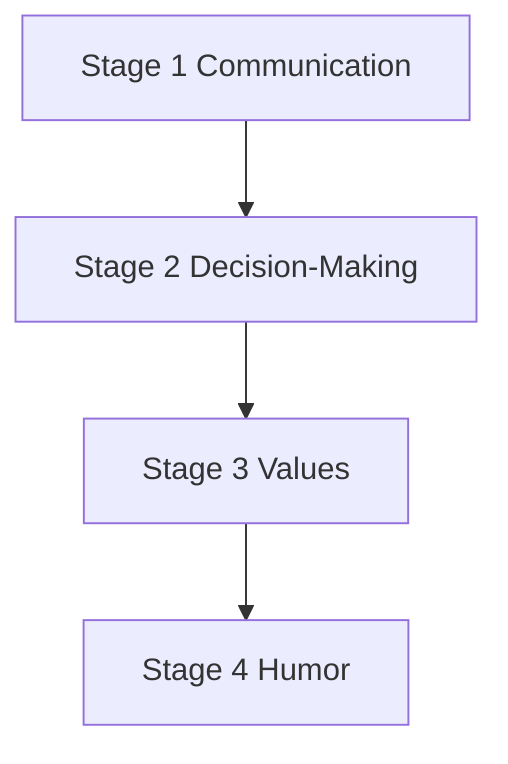

# Priority Dimensions

Stages 1–4 interview content — highest-priority personality dimensions.

## Source Mapping

| Source | Reference |
|--------|-----------|
| seed-document.md | Section 3 (Priority Dimensions — Captured First) |
| seed-document-flow.mermaid | `STAGES` `S1`–`S4` |

## Responsibilities

The first interview stages focus on the **four highest-priority dimensions**:

### Stage 1 — Communication Style and Tone (`S1`)

- How do you naturally write and speak? (formal, casual, direct, verbose)
- How do you open conversations vs. close them?
- Do you prefer short answers or thorough explanations?
- How do you adjust your tone for different audiences?
- What phrases or words do you use often?
- What communication habits do you dislike in others?

### Stage 2 — Decision-Making Patterns (`S2`)

- How do you approach a big decision?
- Do you gather all information first, or decide with what you have?
- How do you handle uncertainty?
- Do you prefer reversible or irreversible decisions and why?
- How do you weigh logic vs. intuition?
- How do you handle being wrong about a decision?

### Stage 3 — Values and Beliefs (`S3`)

- What are your non-negotiables — things you will never compromise on?
- What do you stand for professionally? Personally?
- What do you believe that most people disagree with?
- How do you treat people who are rude to you?
- What makes someone earn your trust?
- What causes you to lose trust in someone?

### Stage 4 — Humor and Personality Quirks (`S4`)

- How would you describe your sense of humor?
- What do you find genuinely funny vs. annoying in humor?
- What are your biggest pet peeves?
- How do you act when you're stressed vs. when you're relaxed?
- How do you handle conflict with people you respect?
- What do people consistently misunderstand about you?

## Inputs / Outputs

| Direction | Content |
|-----------|---------|
| **In** | User answers per [interview-session-flow.md](interview-session-flow.md) |
| **Out** | Stage summaries → [output-format.md](output-format.md) sections |

## Flow

## Rules and Constraints

- Exact question set may be refined collaboratively (open item).
- Maps to wiki sections: Communication Style, Decision-Making, Values and Beliefs, Humor and Personality.

## Open Items

_None — question sets defined in implementation (verbatim from this spec)._

## Cross-References

- [interview-session-flow.md](interview-session-flow.md)
- [output-format.md](output-format.md)
- [minimum-viable-seed.md](minimum-viable-seed.md)
