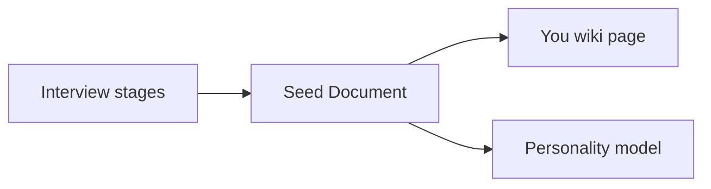

# Purpose

Why the Seed Document exists and how it anchors the personality model.

## Source Mapping

| Source | Reference |
|--------|-----------|
| seed-document.md | Section 1 (Purpose) |
| seed-document-flow.mermaid | Conceptual bootstrap to `WIKI` / personality model |

## Responsibilities

The Seed Document serves **three functions**:

1. **Bootstraps the personality model** — gives C.O.B.R.A. enough signal to respond in the user's voice before behavioral logging has accumulated sufficient data
2. **Grounds the wiki You page** — the seed document becomes the initial content of the "You" wiki page
3. **Sets the baseline** — all future personality updates are measured against this document as the starting reference

## Inputs / Outputs

| Direction | Content |
|-----------|---------|
| **In** | Completed interview stages |
| **Out** | Initial personality signal for [specs/brain/personality-model.md](../brain/personality-model.md) |

## Flow

## Rules and Constraints

- Required before personality model is fully effective ([minimum-viable-seed.md](minimum-viable-seed.md)).
- Cross-ref brain `PE1` seed document collection.

## Open Items

_None specific to this component._

## Cross-References

- [output-format.md](output-format.md)
- [specs/brain/personality-model.md](../brain/personality-model.md)
- [minimum-viable-seed.md](minimum-viable-seed.md)
