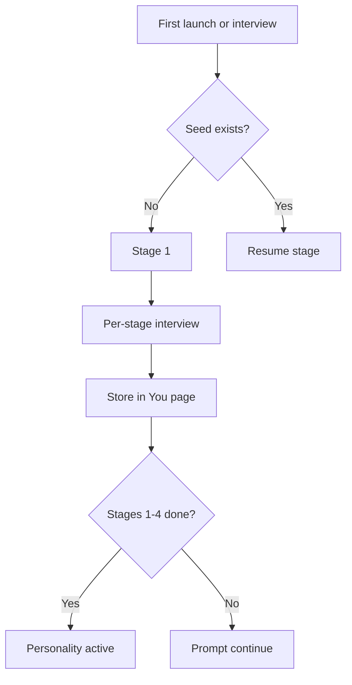

# C.O.B.R.A. Seed Document — Component Overview

*Cognitive Optimized Brain for Retrieval and Action*

**Status:** Draft  
**Version:** 1.0 (decomposed)  
**Parent sources:** [../seed-document.md](../seed-document.md), [../seed-document-flow.mermaid](../seed-document-flow.mermaid)  
**Owner:** Damian  

---

## Purpose

The Seed Document is the foundational personality profile for C.O.B.R.A. It captures who the user is — how they communicate, how they make decisions, what they value, and how they behave — so C.O.B.R.A. can mirror the user's personality accurately from day one.

It is built through a **staged interview process** and lives as a wiki page that C.O.B.R.A. **updates automatically over time**.

---

## High-Level Flow

Authoritative diagram: [../seed-document-flow.mermaid](../seed-document-flow.mermaid).

---

## Component Index

| Component | Spec | seed-document.md | seed-document-flow.mermaid |
|-----------|------|------------------|---------------------------|
| Purpose | [purpose.md](purpose.md) | §1 | Bootstrap to `WIKI` |
| Interview Approach | [interview-approach.md](interview-approach.md) | §2 | Staged sessions |
| Priority Dimensions | [priority-dimensions.md](priority-dimensions.md) | §3 | `S1`–`S4` |
| Additional Dimensions | [additional-dimensions.md](additional-dimensions.md) | §4 | `S5` |
| Interview Stages | [interview-stages.md](interview-stages.md) | Entry/resume | `A`–`D`, `STAGES` |
| Interview Session Flow | [interview-session-flow.md](interview-session-flow.md) | §7 | `INTERVIEW` `I1`–`I12` |
| Output Format | [output-format.md](output-format.md) | §6 | `WIKI` `W1`–`W7` |
| Living Document | [living-document.md](living-document.md) | §5 (auto updates) | `LIVING` `LV1`–`LV5` |
| User Override | [user-override.md](user-override.md) | §5 (manual override) | `OVERRIDE` `OV1`–`OV5` |
| Minimum Viable Seed | [minimum-viable-seed.md](minimum-viable-seed.md) | Readiness | `MVP` `MV1`–`MV3` |

**Implementation sequencing:** [implementation-plan.md](implementation-plan.md)

---

## Cross-Cutting Rules

1. **Staged interviews** — few dimensions per session ([interview-approach.md](interview-approach.md)).
2. **One question per exchange** ([interview-session-flow.md](interview-session-flow.md)).
3. **Approve before store** — summary review required ([interview-session-flow.md](interview-session-flow.md)).
4. **You page at `~/.cobra/wiki/you.md`** ([output-format.md](output-format.md)).
5. **Living updates** with contradiction reconciliation ([living-document.md](living-document.md)).
6. **User override is authoritative** ([user-override.md](user-override.md)).
7. **Stages 1–4 gate personality activation** ([minimum-viable-seed.md](minimum-viable-seed.md)).

---

## Open Items (from seed-document.md)

- [x] Define the exact question set for each stage — implemented verbatim from priority/additional dimension specs
- [x] Define minimum viable seed document — MVP = stages 1–4
- [x] Define how often C.O.B.R.A. prompts the user to complete remaining stages — once per calendar day (MV3)
- [x] Define whether the seed document can be exported for backup — `GET /api/seed/export`

Tracked in owner specs and [implementation-plan.md](implementation-plan.md).

---

*Decomposed from seed-document.md and seed-document-flow.mermaid. Parent spec remains authoritative; these files add implementable component boundaries.*
