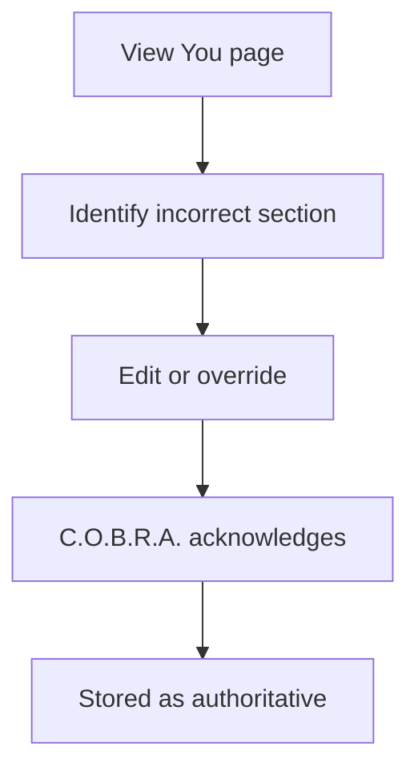

# User Override

Manual review and authoritative correction of seed document sections.

## Source Mapping

| Source | Reference |
|--------|-----------|
| seed-document.md | Section 5 (manual correct/override bullets) |
| seed-document-flow.mermaid | `OVERRIDE` subgraph `OV1`–`OV5` |

## Responsibilities

From §5:

- The user can **manually correct or override any section at any time**

Override flow (`OVERRIDE`):

1. `OV1` User views You page in wiki browser
2. `OV2` User identifies incorrect section
3. `OV3` User edits or overrides section
4. `OV4` C.O.B.R.A. acknowledges override
5. `OV5` Override stored as **authoritative**

Overrides take precedence over automatic updates from [living-document.md](living-document.md).

## Inputs / Outputs

| Direction | Content |
|-----------|---------|
| **In** | User wiki review / edit intent |
| **Out** | Authoritative `you.md` content |

## Flow

## Rules and Constraints

- Wiki browser is read-only in UI for direct edit — override via chat command.
- **Override syntax:** `Override <section>: <content>` (e.g. `Override Communication Style: Always be brief.`).
- Documented behavior: user correction is always authoritative.

## Open Items

_None specific to this component._

## Cross-References

- [living-document.md](living-document.md)
- [specs/chat-ui/wiki-browser-panel.md](../chat-ui/wiki-browser-panel.md)
- [output-format.md](output-format.md)
