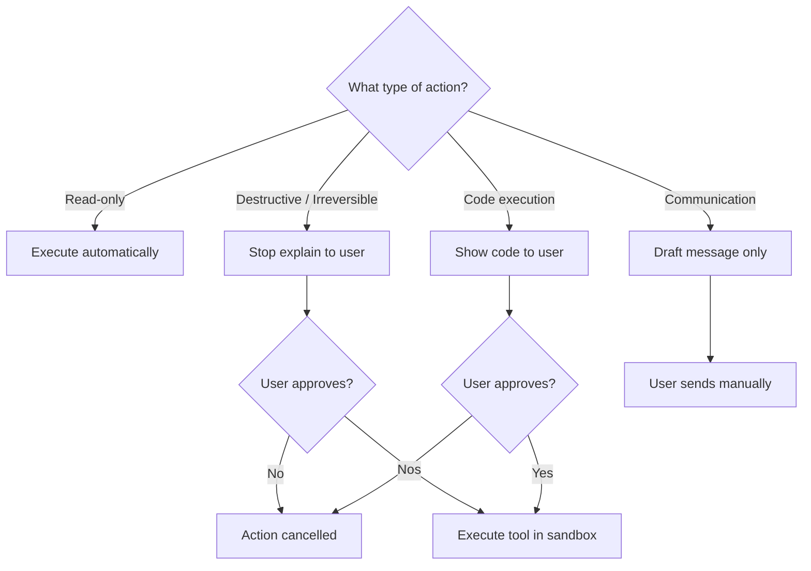

# Approval Model

Governs when tools run automatically, require approval, or produce drafts only.

## Source Mapping

| Source | Reference |
|--------|-----------|
| tools.md | Section 2 (Approval Model), 2.1–2.4 |
| tools-flow.mermaid | `C`, `E`, `F`, `H`, `I`, `J`, `K` |

## Responsibilities

### 2.1 Read-Only (`B` → `C`)

- Tools that only read or retrieve data execute automatically without approval.
- Examples: web search, reading a file, checking the calendar, reading system status.
- **`C`:** Execute automatically — no approval needed.
- Then `D` chain check ([tool-chaining.md](tool-chaining.md)).

### 2.2 Destructive or Irreversible (`B` → `E` → `F`)

- Any call that modifies, deletes, sends, or creates something requires explicit approval before execution.
- Examples: deleting a file, creating a calendar event, sending a message, changing system settings.
- **`E`:** Stop — explain exactly what will be done and why.
- **`F`:** User approves?
  - No → `DENIED` — **Denied = nothing executed.**
  - Yes → `G` Execute tool in sandbox.

### 2.3 Communication — Special Rule (`B` → `J` → `K`)

- C.O.B.R.A. **never sends messages on behalf of the user.**
- All communication tools produce **drafts only**; user always sends manually.
- Applies to email, Slack, Discord, and any other communication tool regardless of recipient.
- **`J`:** Draft message only — never send automatically.
- **`K`:** User sends manually (terminal path; does not pass through `G`).

### 2.4 Code Execution — Special Rule (`B` → `H` → `I`)

- C.O.B.R.A. **always shows the user the code before running it**, no exceptions.
- User reviews and approves before execution proceeds.
- Applies to all scripts regardless of complexity or scope.
- **`H`:** Show code to user — always, no exceptions.
- **`I`:** User approves?
  - No → `DENIED`
  - Yes → `G` Execute tool in sandbox.

## Inputs / Outputs

| Direction | Content |
|-----------|---------|
| **In** | Routed tool call from `B` |
| **Out** | Auto-execute (`C`), sandbox execute (`G`), draft (`K`), or cancel (`DENIED`) |

## Flow

## Rules and Constraints

- Destructive: stop, explain, wait — denied = nothing executed.
- Communication: never auto-send.
- Code: always show code before run.

## Open Items

- [ ] Define which communication platforms are supported at launch (tools.md Open Items)

## Cross-References

- [execution-flow.md](execution-flow.md) — `B`, `G`, `DENIED`
- [tool-chaining.md](tool-chaining.md) — pause at destructive step
- [privacy.md](privacy.md) — `J` enforced by privacy
