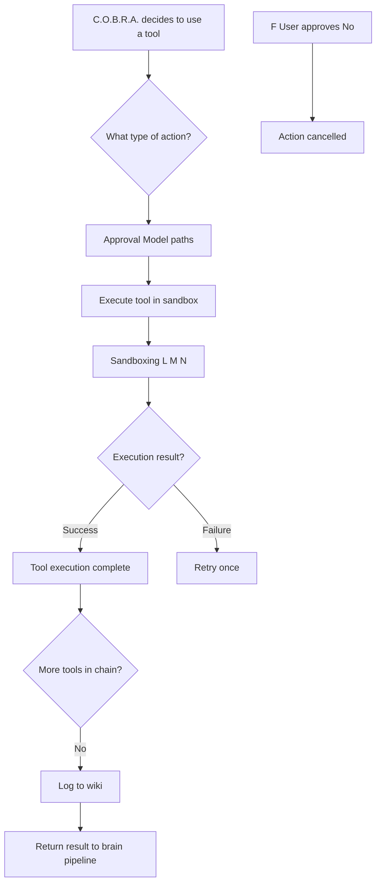

# Execution Flow

Core runtime spine from tool decision through execution result and return to the brain.

## Source Mapping

| Source | Reference |
|--------|-----------|
| tools.md | Overview; implicit orchestration across sections 2–6 |
| tools-flow.mermaid | `A`, `B`, `G`, `O`, `SUCCESS`, `DENIED`, `U` |

## Responsibilities

- **`A`:** Entry when C.O.B.R.A. decides to use a tool (from brain pipeline).
- **`B`:** Route by action type to approval paths (see [approval-model.md](approval-model.md)).
- **`G`:** Execute approved tool (enters sandbox path per [sandboxing.md](sandboxing.md)).
- **`O`:** Branch on execution result → success or failure ([failure-handling.md](failure-handling.md)).
- **`SUCCESS`:** Tool execution complete.
- **`DENIED`:** Action cancelled when user denies approval (`F`/`I` → `DENIED`).
- **`U`:** Return result to brain pipeline after logging ([tool-memory.md](tool-memory.md)).

Post-success: chaining (`T`) and logging (`LOG`) per [tool-chaining.md](tool-chaining.md) and [tool-memory.md](tool-memory.md).

## Inputs / Outputs

| Direction | Content |
|-----------|---------|
| **In** | Tool invocation request from brain; approved execution from approval paths |
| **Out** | `SUCCESS` + logged result → `U`; or `DENIED`; or failure path → `S` |

## Flow

## Rules and Constraints

- Execution always flows through sandbox decision (`G` → `L`) unless communication draft-only path (`J` → `K`, no `G`).
- Privacy enforced on execute paths ([privacy.md](privacy.md): `G` -.-> `PRIVACY`).

## Open Items

_None specific to this component._

## Cross-References

- [approval-model.md](approval-model.md)
- [sandboxing.md](sandboxing.md)
- [failure-handling.md](failure-handling.md)
- [tool-chaining.md](tool-chaining.md)
- [tool-memory.md](tool-memory.md)
- [privacy.md](privacy.md)
