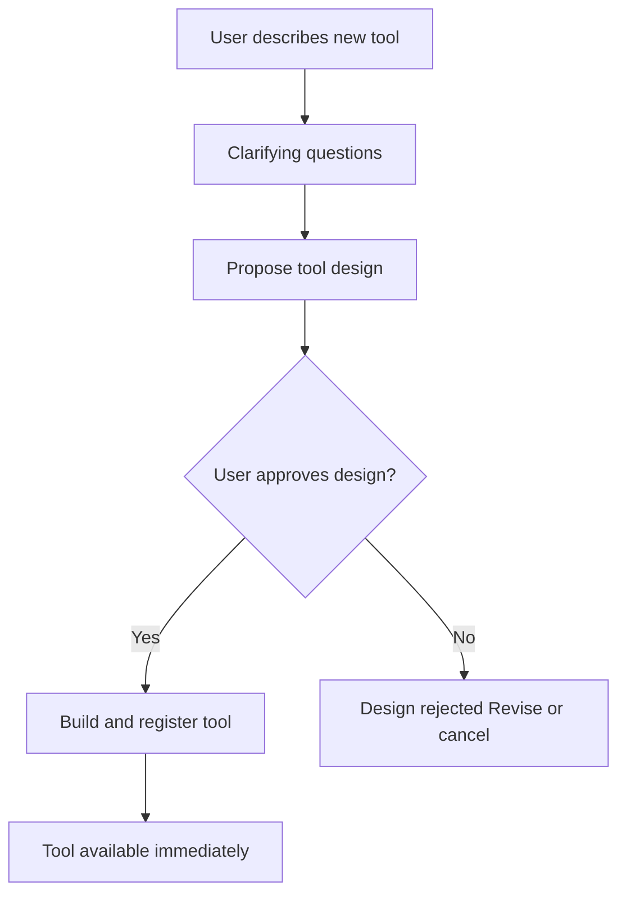

# Extensibility

User-driven addition of new tools that inherit all governance rules automatically.

## Source Mapping

| Source | Reference |
|--------|-----------|
| tools.md | Section 7 (Extensibility) |
| tools-flow.mermaid | subgraph `EXTEND` (`E1`–`E7`) |

## Responsibilities

When the user wants to add a new tool:

| Step | Node | Action |
|------|------|--------|
| 1 | `E1` | User describes new tool in plain language |
| 2 | `E2` | C.O.B.R.A. asks clarifying questions if needed |
| 3 | `E3` | C.O.B.R.A. proposes tool design |
| 4 | `E4` | User approves design? |
| Yes | `E5` → `E6` | Build and register tool; tool available immediately |
| No | `E7` | Design rejected — revise or cancel |

Upon registration (`E6`):

- Tool immediately available for use.
- Follows all approval, sandboxing, and logging rules automatically ([approval-model.md](approval-model.md), [sandboxing.md](sandboxing.md), [tool-memory.md](tool-memory.md)).

Maps to **Extensibility** row in [tool-set.md](tool-set.md).

## Inputs / Outputs

| Direction | Content |
|-----------|---------|
| **In** | User plain-language tool description |
| **Out** | Registered tool in catalog, or cancelled/revised design |

## Flow

## Rules and Constraints

- **No implementation begins without user approval at step 4** (tools.md §7).
- New tools must not bypass approval, sandbox, privacy, or logging rules.

## Open Items

- [ ] Define tool registry format for storing and loading custom tools (tools.md Open Items)

## Cross-References

- [tool-set.md](tool-set.md) — Extensibility tool
- [approval-model.md](approval-model.md)
- [sandboxing.md](sandboxing.md)
- [tool-memory.md](tool-memory.md)
- [privacy.md](privacy.md)
