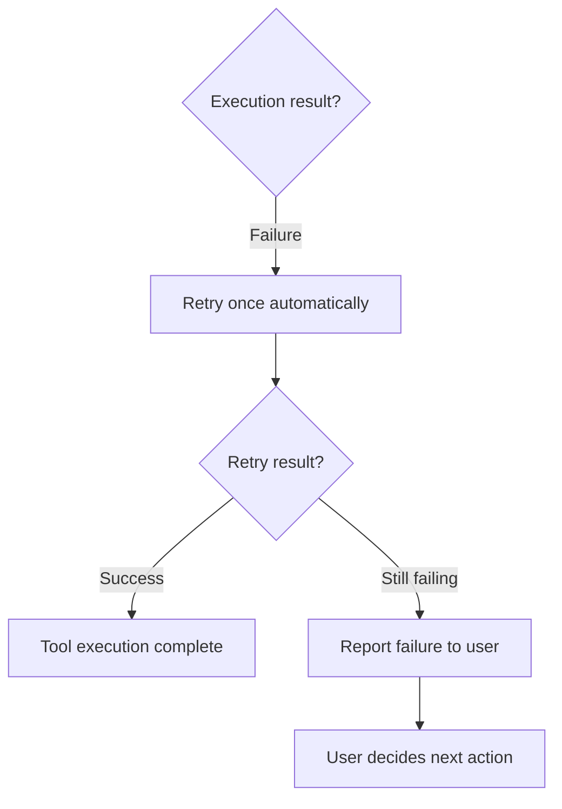

# Failure Handling

Retries, user notification, and recovery when tool execution fails.

## Source Mapping

| Source | Reference |
|--------|-----------|
| tools.md | Section 4 (Failure Handling) |
| tools-flow.mermaid | `P`, `Q`, `R`, `S` |

## Responsibilities

When a tool fails or returns an error (`O` → Failure):

1. **`P`:** Retry once automatically.
2. **`Q`:** Retry result?
   - Success → `SUCCESS`
   - Still failing → `R`
3. **`R`:** Report failure to user; ask how to proceed.
4. **`S`:** User decides next action.

Additionally (tools.md §4):

- Do not silently swallow errors.
- Do not substitute unrelated tools without notifying the user.

Mid-chain failures defer to these rules per [tool-chaining.md](tool-chaining.md).

## Inputs / Outputs

| Direction | Content |
|-----------|---------|
| **In** | Failed execution from `O` |
| **Out** | Recovered `SUCCESS`, or user-directed next step via `S` |

## Flow

## Rules and Constraints

- Exactly one automatic retry before escalating to user (diagram: “Retry once”; tools.md step 1).
- No silent error swallowing; no undisclosed tool substitution.

## Open Items

- [ ] Define specific retry count before reporting failure (e.g. 1 retry or 2) (tools.md Open Items)

## Cross-References

- [execution-flow.md](execution-flow.md) — `O`
- [tool-chaining.md](tool-chaining.md) — mid-chain failures
