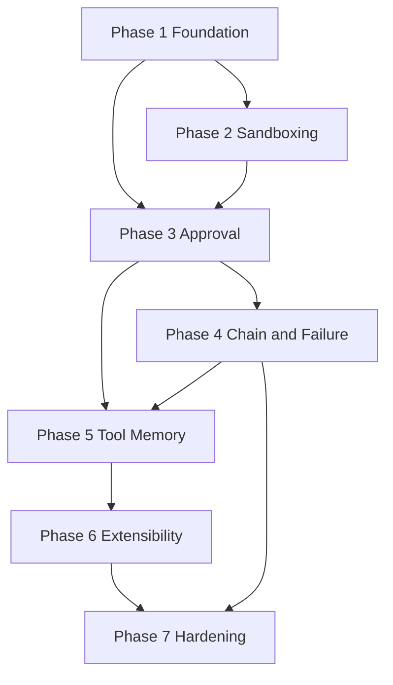

# Tools — Implementation Plan

Phased build order for the C.O.B.R.A. Tools component. Each phase maps to specs in this folder. **No implementation begins without user approval** (per parent [../tools.md](../tools.md)).

---

## Blocking Decisions (tools.md Open Items)

| Open item | Blocks | Owner spec |
|-----------|--------|------------|
| Retry count before reporting failure | Phase 4 failure handling | [failure-handling.md](failure-handling.md) |
| Sandbox technology | Phase 2 sandboxing | [sandboxing.md](sandboxing.md) |
| Communication platforms at launch | Phase 3 approval (communication) | [approval-model.md](approval-model.md), [tool-set.md](tool-set.md) |
| Tool registry format | Phase 6 extensibility | [extensibility.md](extensibility.md) |

---

## Phase 1 — Foundation

**Goal:** Tool catalog, entry point, and privacy gate.

| Deliverable | Spec |
|-------------|------|
| Register built-in tools (8 + extensibility slot); browser control excluded | [tool-set.md](tool-set.md) |
| Entry `A` → action-type router `B` stub | [execution-flow.md](execution-flow.md) |
| Privacy sanitization for outbound calls; local-only log policy | [privacy.md](privacy.md) |

**Exit criteria:** Tool identity resolves to action type; outbound payloads screened per `PR1`–`PR3`.

---

## Phase 2 — Sandboxing and Execution Core

**Goal:** Run approved tools in isolated environment.

| Deliverable | Spec |
|-------------|------|
| Default sandbox (`L` → `M`); per-tool per-session override (`N`) with user notification | [sandboxing.md](sandboxing.md) |
| `G` → `O` success path to `SUCCESS` | [execution-flow.md](execution-flow.md) |
| Return to brain `U` (without logging yet) | [execution-flow.md](execution-flow.md) |

**Exit criteria:** Approved tool runs sandboxed or with explicit override; result returned.

**Blocked by:** sandbox technology choice.

---

## Phase 3 — Approval Model

**Goal:** All four action-type paths.

| Deliverable | Spec |
|-------------|------|
| Read-only auto-execute `C` + chain gate `D` | [approval-model.md](approval-model.md), [tool-chaining.md](tool-chaining.md) |
| Destructive stop/explain/approve `E`/`F` → `G` or `DENIED` | [approval-model.md](approval-model.md) |
| Code show/approve `H`/`I` | [approval-model.md](approval-model.md) |
| Communication draft-only `J` → `K` | [approval-model.md](approval-model.md), [privacy.md](privacy.md) |

**Exit criteria:** Each action type follows its hard rule; denied = nothing executed.

**Blocked by:** communication platforms at launch (for integrations).

---

## Phase 4 — Chaining and Failure Handling

**Goal:** Multi-step tasks with retry and user escalation.

| Deliverable | Spec |
|-------------|------|
| Read-only chains end-to-end; destructive pause; `T` loop to `B` | [tool-chaining.md](tool-chaining.md) |
| Retry once `P`/`Q`; report and `S` on persistent failure | [failure-handling.md](failure-handling.md) |
| No silent errors or undisclosed tool substitution | [failure-handling.md](failure-handling.md) |

**Exit criteria:** Example email+summarize+calendar chain behaves per tools.md §3.

**Blocked by:** retry count confirmation (diagram says once; open item asks to confirm).

---

## Phase 5 — Tool Memory

**Goal:** Wiki logging and learning hooks.

| Deliverable | Spec |
|-------------|------|
| `LOG` after chain complete: tool, action, outcome, timestamp | [tool-memory.md](tool-memory.md) |
| Dedicated wiki Tools log page; feed `TM5` selection improvements | [tool-memory.md](tool-memory.md) |
| Wire `LOG` → `U` with logged metadata | [execution-flow.md](execution-flow.md) |

**Exit criteria:** Every completed invocation persisted locally; pattern surfacing hook available.

---

## Phase 6 — Extensibility

**Goal:** User-defined tools via approval workflow.

| Deliverable | Spec |
|-------------|------|
| `E1`–`E7` design/build/register flow | [extensibility.md](extensibility.md) |
| Registry load/save format | [extensibility.md](extensibility.md) |
| New tools inherit approval, sandbox, privacy, logging | [extensibility.md](extensibility.md) |

**Exit criteria:** User-approved custom tool runs through same `B` → paths as built-ins.

**Blocked by:** tool registry format.

**Blocked at step 4:** no build without user approval on design.

---

## Phase 7 — Integration Hardening

**Goal:** Brain pipeline integration and end-to-end validation.

| Deliverable | Spec |
|-------------|------|
| Brain `P2` Tool Execution invokes tools `A` and receives `U` | [execution-flow.md](execution-flow.md) |
| Align privacy with brain [privacy.md](../brain/privacy.md) | [privacy.md](privacy.md) |
| Full [../tools-flow.mermaid](../tools-flow.mermaid) path test | [tools-overview.md](tools-overview.md) |

**Exit criteria:** All open items closed or explicitly deferred with user approval.

---

## Dependency Graph

---

## Spec File Checklist

- [tool-set.md](tool-set.md)
- [execution-flow.md](execution-flow.md)
- [approval-model.md](approval-model.md)
- [tool-chaining.md](tool-chaining.md)
- [failure-handling.md](failure-handling.md)
- [sandboxing.md](sandboxing.md)
- [tool-memory.md](tool-memory.md)
- [extensibility.md](extensibility.md)
- [privacy.md](privacy.md)
- [tools-overview.md](tools-overview.md)
- [implementation-plan.md](implementation-plan.md)
