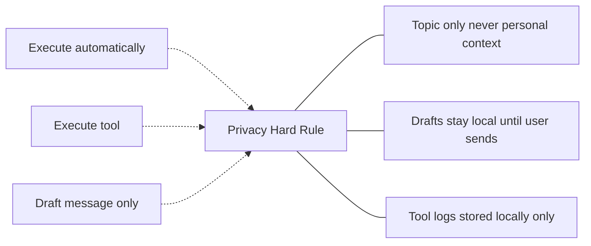

# Privacy (Hard Rule)

Master privacy constraints for all tool calls, aligned with the brain component.

## Source Mapping

| Source | Reference |
|--------|-----------|
| tools.md | Section 8 (Privacy — Hard Rule) |
| tools-flow.mermaid | subgraph `PRIVACY` (`PR1`–`PR3`); enforcement edges to `C`, `G`, `J` |

## Responsibilities

All tool calls follow the same master privacy rule as the brain:

### `PR1` — Outbound sanitization

- Outbound tool calls sanitized — **topic only, never personal context**.
- Example domain: web search queries (tools.md §8).

### `PR2` — Communication drafts

- Communication drafts **stay local until user sends** (pairs with [approval-model.md](approval-model.md) `J` → `K`).

### `PR3` — Local tool logs

- Tool logs stored **locally only** (pairs with [tool-memory.md](tool-memory.md)).

### Enforcement points (diagram)

- Read-only auto-execute: `C` -.-> enforced by `PRIVACY`
- Execute: `G` -.-> enforced by `PRIVACY`
- Communication draft: `J` -.-> enforced by `PRIVACY`

### tools.md §8 (verbatim policy)

- Tools never send personal data externally without explicit user approval.
- Outbound tool calls (e.g. web search) sanitized — topic only, never personal context.
- Communication drafts stay local until the user manually sends them.

## Inputs / Outputs

| Direction | Content |
|-----------|---------|
| **In** | Outbound payloads from read-only, execute, and communication paths |
| **Out** | Sanitized queries; blocked sends without approval; local-only logs |

## Flow

## Rules and Constraints

- Same master privacy rule as brain — no personal data externally without explicit per-request approval.
- Align with brain [privacy.md](../brain/privacy.md) where tools touch outbound or logging paths.

## Open Items

_None beyond global tools open items._

## Cross-References

- [approval-model.md](approval-model.md) — communication and code paths
- [tool-memory.md](tool-memory.md) — `PR3`
- [execution-flow.md](execution-flow.md) — `G`
- [tools-overview.md](tools-overview.md)
