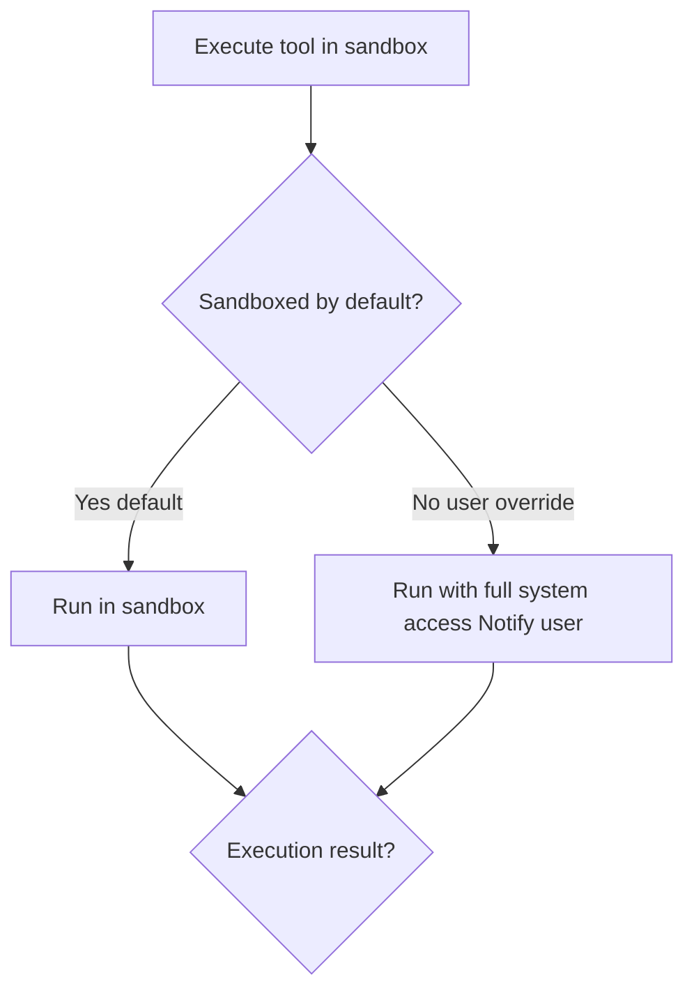

# Sandboxing

Isolates tool execution by default; optional per-tool, per-session full-access override.

## Source Mapping

| Source | Reference |
|--------|-----------|
| tools.md | Section 5 (Sandboxing), 5.1–5.2 |
| tools-flow.mermaid | `L`, `M`, `N` |

## Responsibilities

### 5.1 Default (`L` → `M`)

- All tools run in a sandboxed environment by default.
- Isolates execution from the rest of the user's system, preventing accidental damage.
- **`M`:** Run in sandbox.

### 5.2 Override (`L` → `N`)

- User may explicitly grant full system access to a **specific tool** when needed.
- **Per-tool, per-session** override — not a global setting.
- C.O.B.R.A. **notifies the user** when a tool runs outside the sandbox.
- **`N`:** Run with full system access — notify user.

Both paths converge at `O` Execution result? ([execution-flow.md](execution-flow.md)).

Entry: approved execution `G` → `L` Sandboxed by default?

## Inputs / Outputs

| Direction | Content |
|-----------|---------|
| **In** | Approved tool execution from `G` |
| **Out** | Sandboxed or full-access run → success/failure to `O` |

## Flow

## Rules and Constraints

- Default is always sandboxed unless user grants per-tool, per-session override.
- Notify user on every non-sandboxed run.

## Open Items

- [ ] Define sandbox technology (e.g. Docker, subprocess isolation, virtual environment) (tools.md Open Items)

## Cross-References

- [execution-flow.md](execution-flow.md) — `G`, `O`
- [approval-model.md](approval-model.md) — pre-sandbox approval gates
