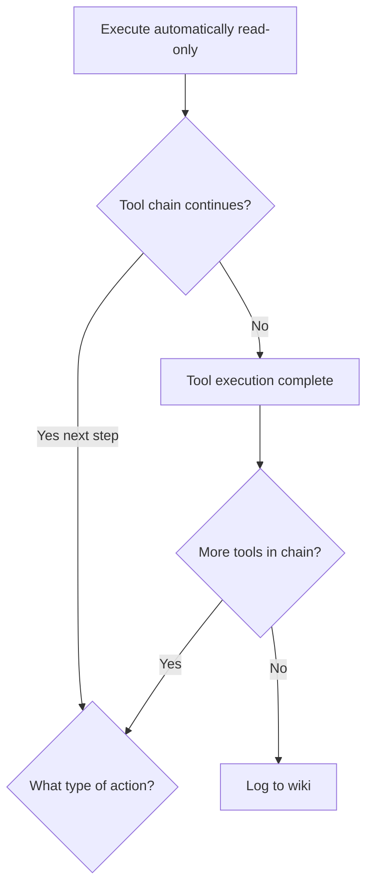

# Tool Chaining

Sequences multiple tool calls to complete complex tasks with minimal user interruption.

## Source Mapping

| Source | Reference |
|--------|-----------|
| tools.md | Section 3 (Tool Chaining) |
| tools-flow.mermaid | `D`, `T` |

## Responsibilities

- Chain multiple tools automatically to complete complex tasks without interrupting the user when rules allow.

**Example (tools.md):**  
“Summarize my emails about the C.O.B.R.A. project and add a task to my calendar” → read emails (read-only, automatic) → summarize → create calendar event (destructive, requires approval before creating).

### Chain control nodes

- **`D`:** After read-only auto-execute (`C`), ask whether tool chain continues.
  - Yes — next step → return to `B` What type of action?
  - No → `SUCCESS`
- **`T`:** After `SUCCESS`, ask whether more tools remain in chain.
  - Yes → return to `B`
  - No → `LOG` ([tool-memory.md](tool-memory.md))

### Rules (tools.md §3)

- Read-only chains execute automatically end to end.
- If any step is destructive, pause the chain at that step and ask for approval before continuing ([approval-model.md](approval-model.md) `E`/`F`).
- If a step fails mid-chain, [failure-handling.md](failure-handling.md) applies.

## Inputs / Outputs

| Direction | Content |
|-----------|---------|
| **In** | Multi-step task plan from brain; intermediate results between steps |
| **Out** | Completed chain → `LOG` → `U`; or paused for approval; or failure handoff |

## Flow

## Rules and Constraints

- Read-only segments: no approval interruption between steps.
- Destructive step: mandatory pause and approval before that step executes.
- Mid-chain failure: no silent substitution of unrelated tools ([failure-handling.md](failure-handling.md)).

## Open Items

_None specific to this component._

## Cross-References

- [approval-model.md](approval-model.md)
- [failure-handling.md](failure-handling.md)
- [execution-flow.md](execution-flow.md)
- [tool-memory.md](tool-memory.md)
