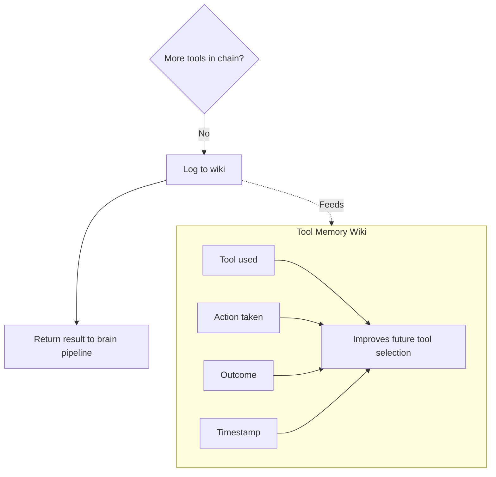

# Tool Memory

Logs every tool call locally in the wiki to improve selection, chaining, and pattern surfacing.

## Source Mapping

| Source | Reference |
|--------|-----------|
| tools.md | Section 6 (Tool Memory) |
| tools-flow.mermaid | `LOG`; subgraph `MEMORY` (`TM1`–`TM5`) |

## Responsibilities

### Logging (`LOG`)

After chain completes (`T` → No → `LOG`):

- Log to wiki: **tool + action + outcome + timestamp**
- Then return result to brain pipeline (`LOG` → `U`)

### Wiki record fields (`TM1`–`TM4`)

- **`TM1`:** Tool used
- **`TM2`:** Action taken
- **`TM3`:** Outcome (success or failure)
- **`TM4`:** Timestamp

Stored on dedicated **Tools log page** in wiki (tools.md §6).

### Uses (`TM5`)

- Learn user's tool preferences over time
- Improve future tool selection and chaining decisions
- Surface patterns (e.g. “You run this type of search every Monday”)

`LOG` -.-> feeds `MEMORY` (`TM1`–`TM5`).

## Inputs / Outputs

| Direction | Content |
|-----------|---------|
| **In** | Completed tool execution (`SUCCESS` path after `T` → No) |
| **Out** | Wiki log entry; learning signals for future `B` routing / chaining |

## Flow

## Rules and Constraints

- Every tool call logged in full.
- Tool memory follows same privacy rules as all other memory — **fully local, never sent externally** (tools.md §6; [privacy.md](privacy.md) `PR3`).

## Open Items

_None specific to this component._

## Cross-References

- [execution-flow.md](execution-flow.md) — `U`
- [tool-chaining.md](tool-chaining.md) — `T`, `LOG`
- [privacy.md](privacy.md) — local-only logs
- [extensibility.md](extensibility.md) — new tools logged same way
