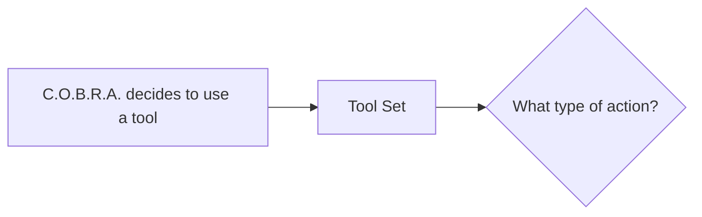

# Tool Set

Catalog of every action C.O.B.R.A. can take beyond conversation.

## Source Mapping

| Source | Reference |
|--------|-----------|
| tools.md | Section 1 (Tool Set) |
| tools-flow.mermaid | Feeds action-type routing at `B` (tool catalog is implicit entry context from `A`) |

## Responsibilities

Define and expose the built-in tools C.O.B.R.A. may invoke:

| Tool | Description |
|------|-------------|
| **Web Search** | Search the internet for information |
| **Code Execution** | Write and run code on the user's machine |
| **File Management** | Read, write, and organize files and folders |
| **App Control** | Open, close, and interact with applications |
| **Calendar** | Read and create events, check schedule |
| **Communication** | Draft emails and messages (Slack, Discord, etc.) |
| **System Control** | Volume, brightness, notifications, system settings |
| **Extensibility** | Add new tools on demand |

Each tool is classified at runtime by [approval-model.md](approval-model.md) (read-only, destructive, code execution, communication) before execution.

Custom tools registered via [extensibility.md](extensibility.md) join this set and inherit the same rules.

## Inputs / Outputs

| Direction | Content |
|-----------|---------|
| **In** | Brain pipeline tool request (`A`); user-defined tools from extensibility |
| **Out** | Resolved tool identity and action type → `B` What type of action? |

## Flow

## Rules and Constraints

- **Browser control is explicitly excluded.**

## Open Items

- [ ] Define which communication platforms are supported at launch (email, Slack, Discord, etc.) (tools.md Open Items)

## Cross-References

- [execution-flow.md](execution-flow.md) — `A`, `B`
- [approval-model.md](approval-model.md) — per-tool approval class
- [extensibility.md](extensibility.md) — new tools on demand
