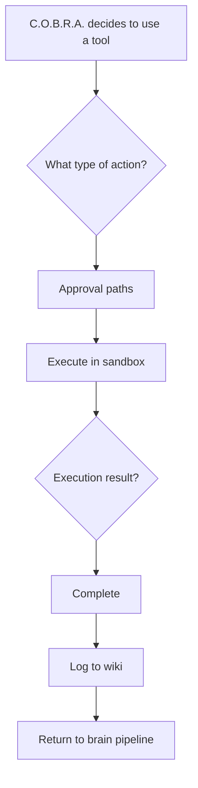

# C.O.B.R.A. Tools — Component Overview

*Cognitive Optimized Brain for Retrieval and Action*

**Status:** Draft  
**Version:** 1.0 (decomposed)  
**Parent sources:** [../tools.md](../tools.md), [../tools-flow.mermaid](../tools-flow.mermaid)  
**Owner:** Damian  

---

## Purpose

The Tools component defines every action C.O.B.R.A. can take on behalf of the user beyond conversation. Tools are:

- **Sandboxed by default**
- **Logged for learning**
- Governed by a **clear approval model**

The user retains full control over destructive actions and all outbound communication.

---

## High-Level Flow

Authoritative diagram: [../tools-flow.mermaid](../tools-flow.mermaid).

---

## Component Index

| Component | Spec | tools.md | tools-flow.mermaid |
|-----------|------|----------|-------------------|
| Tool Set | [tool-set.md](tool-set.md) | §1 | Catalog → `B` |
| Execution Flow | [execution-flow.md](execution-flow.md) | Overview | `A`, `B`, `G`, `O`, `SUCCESS`, `DENIED`, `U` |
| Approval Model | [approval-model.md](approval-model.md) | §2 | `C`, `E`, `F`, `H`, `I`, `J`, `K` |
| Tool Chaining | [tool-chaining.md](tool-chaining.md) | §3 | `D`, `T` |
| Failure Handling | [failure-handling.md](failure-handling.md) | §4 | `P`, `Q`, `R`, `S` |
| Sandboxing | [sandboxing.md](sandboxing.md) | §5 | `L`, `M`, `N` |
| Tool Memory | [tool-memory.md](tool-memory.md) | §6 | `LOG`, `MEMORY` `TM1`–`TM5` |
| Extensibility | [extensibility.md](extensibility.md) | §7 | `EXTEND` `E1`–`E7` |
| Privacy | [privacy.md](privacy.md) | §8 | `PRIVACY` `PR1`–`PR3` |

**Implementation sequencing:** [implementation-plan.md](implementation-plan.md)

---

## Cross-Cutting Rules

1. **Read-only auto-execute** — no approval for read/retrieve only ([approval-model.md](approval-model.md)).
2. **Destructive pause** — explain, wait, denied = nothing executed.
3. **Communication** — drafts only; user sends manually; never auto-send.
4. **Code** — always show code before run; user approves.
5. **Sandbox default** — per-tool, per-session override with notification.
6. **One retry** — then report to user; no silent errors or tool substitution.
7. **Full logging** — wiki Tools log; local only ([tool-memory.md](tool-memory.md)).
8. **Privacy** — topic only outbound; drafts and logs stay local ([privacy.md](privacy.md)).
9. **Browser control excluded** ([tool-set.md](tool-set.md)).

---

## Open Items (from tools.md)

- [ ] Define specific retry count before reporting failure (e.g. 1 retry or 2)
- [ ] Define sandbox technology (e.g. Docker, subprocess isolation, virtual environment)
- [ ] Define which communication platforms are supported at launch (email, Slack, Discord, etc.)
- [ ] Define tool registry format for storing and loading custom tools

Tracked in owner specs and [implementation-plan.md](implementation-plan.md).

---

*Decomposed from tools.md and tools-flow.mermaid. Parent spec remains authoritative; these files add implementable component boundaries.*
