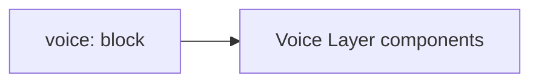

# Configuration

YAML keys for the Voice Layer in C.O.B.R.A. config.

## Source Mapping

| Source | Reference |
|--------|-----------|
| voice.md | Section 8 (Configuration) |
| voice-flow.mermaid | Implicit config driving `B`, `D`, `O1`, `O2` |

## Responsibilities

Define the `voice:` block:

```yaml
voice:
  wake_word: ""                    # User-defined custom wake word
  session_end_phrase: "That's all for now C.O.B.R.A."
  audio_cue: true                  # Play tone on activation
  tts_model: xtts                  # Local TTS model (xtts, coqui, etc.)
  voice_model_path: ~/.cobra/voice/
  speaking_speed_adaptation: true  # Adapt speed to mood inference
  output_mode: both                # voice + text simultaneously
```

| Key | Used by |
|-----|---------|
| `wake_word` | [wake-word.md](wake-word.md) |
| `session_end_phrase` | [wake-word.md](wake-word.md), [session-lifecycle.md](session-lifecycle.md) |
| `audio_cue` | [wake-word.md](wake-word.md), [voice-input-pipeline.md](voice-input-pipeline.md) |
| `tts_model` | [voice-cloning.md](voice-cloning.md) |
| `voice_model_path` | [voice-cloning.md](voice-cloning.md) |
| `speaking_speed_adaptation` | [voice-output.md](voice-output.md) |
| `output_mode` | [voice-output.md](voice-output.md) |

## Inputs / Outputs

| Direction | Content |
|-----------|---------|
| **In** | `~/.cobra/config.yaml` |
| **Out** | Runtime voice layer settings |

## Flow



## Rules and Constraints

- All paths local under `~/.cobra/`.
- May be extended in parent [specs/configuration/config-file-structure.md](../configuration/config-file-structure.md) when integrated.

## Open Items

_None specific to this component._

## Cross-References

- [specs/configuration/hot-reload.md](../configuration/hot-reload.md)
- [wake-word.md](wake-word.md)
- [voice-cloning.md](voice-cloning.md)
