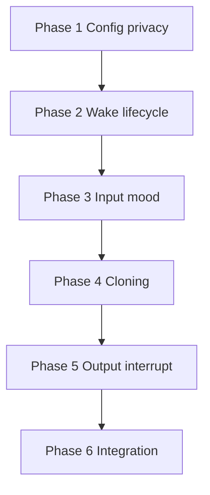

# Voice — Implementation Plan

Phased build order for the C.O.B.R.A. Voice Layer component. Each phase maps to specs in this folder. **No implementation begins without user approval** (per parent [../voice.md](../voice.md)).

---

## Blocking Decisions (voice.md Open Items)

| Open item | Blocks | Owner spec |
|-----------|--------|------------|
| Wake word detection library | Phase 2 wake word | [wake-word.md](wake-word.md) |
| Whisper confidence threshold | Phase 3 input pipeline | [voice-input-pipeline.md](voice-input-pipeline.md) |
| Audio cue sound | Phase 2 wake word | [wake-word.md](wake-word.md) |
| Voice sample quality requirements | Phase 4 cloning | [voice-cloning.md](voice-cloning.md) |
| Missing/corrupt model on startup | Phase 5 output | [voice-cloning.md](voice-cloning.md), [voice-output.md](voice-output.md) |
| Append vs replace voice samples | Phase 4 cloning | [voice-cloning.md](voice-cloning.md) |

---

## Phase 1 — Config and Privacy

**Goal:** Load voice settings; enforce local-only audio rules.

| Deliverable | Spec |
|-------------|------|
| `voice:` YAML block | [configuration.md](configuration.md) |
| Hard privacy rules | [privacy.md](privacy.md) |

**Exit criteria:** Config round-trip; no cloud audio paths in design.

---

## Phase 2 — Wake Word and Session Lifecycle

**Goal:** Passive → active → passive loop with audio cue.

| Deliverable | Spec |
|-------------|------|
| Local wake word loop `B`/`C` | [wake-word.md](wake-word.md) |
| Session end phrase `H`/`ACK` | [wake-word.md](wake-word.md), [session-lifecycle.md](session-lifecycle.md) |
| Lifecycle states `LC1`–`LC3` | [session-lifecycle.md](session-lifecycle.md) |

**Exit criteria:** Wake activates session; end phrase returns to passive; no timeout.

**Blocked by:** wake word library; audio cue sound.

---

## Phase 3 — Input Pipeline and Mood

**Goal:** Capture → Whisper → brain; parallel mood inference.

| Deliverable | Spec |
|-------------|------|
| `I1`–`I5` transcription path | [voice-input-pipeline.md](voice-input-pipeline.md) |
| `M1`–`M4` mood to context | [mood-inference.md](mood-inference.md) |
| Handoff to Input Mode Layer | [specs/brain/input-mode-layer.md](../brain/input-mode-layer.md) |

**Exit criteria:** Low-confidence retry loop works; text reaches brain.

**Blocked by:** Whisper confidence threshold.

---

## Phase 4 — Voice Cloning Setup

**Goal:** Guided recording and local XTTS/Coqui training.

| Deliverable | Spec |
|-------------|------|
| `CL1`–`CL7` setup flow | [voice-cloning.md](voice-cloning.md) |
| Model at `~/.cobra/voice/` | [voice-cloning.md](voice-cloning.md) |

**Exit criteria:** User-approved clone; retrain path available.

**Blocked by:** sample quality requirements; append vs replace policy.

---

## Phase 5 — Output and Interruption

**Goal:** Cloned TTS + Chat UI text; queue mid-response speech.

| Deliverable | Spec |
|-------------|------|
| `O1`–`O4` dual output | [voice-output.md](voice-output.md) |
| `IR1`–`IR4` queue | [interruption-handling.md](interruption-handling.md) |
| Voice indicator states | [specs/chat-ui/top-bar.md](../chat-ui/top-bar.md) |

**Exit criteria:** Every brain response plays voice and shows text; no cutoff.

**Blocked by:** missing/corrupt model behavior.

---

## Phase 6 — Integration Hardening

**Goal:** End-to-end voice session with brain and Chat UI.

| Deliverable | Spec |
|-------------|------|
| Full [../voice-flow.mermaid](../voice-flow.mermaid) path | [voice-overview.md](voice-overview.md) |
| Context mood consumption | [specs/brain/context-awareness.md](../brain/context-awareness.md) |

**Exit criteria:** All open items closed or explicitly deferred with user approval.

---

## Dependency Graph

---

## Spec File Checklist

- [wake-word.md](wake-word.md)
- [voice-input-pipeline.md](voice-input-pipeline.md)
- [mood-inference.md](mood-inference.md)
- [voice-cloning.md](voice-cloning.md)
- [voice-output.md](voice-output.md)
- [interruption-handling.md](interruption-handling.md)
- [session-lifecycle.md](session-lifecycle.md)
- [privacy.md](privacy.md)
- [configuration.md](configuration.md)
- [voice-overview.md](voice-overview.md)
- [implementation-plan.md](implementation-plan.md)
