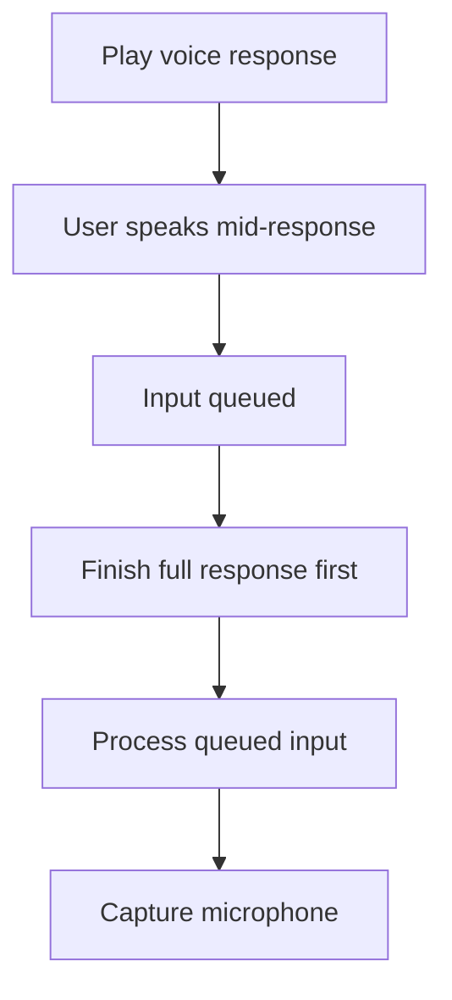

# Interruption Handling

Queue user speech during C.O.B.R.A. responses; never cut off mid-response.

## Source Mapping

| Source | Reference |
|--------|-----------|
| voice.md | Section 4 (Interruption Handling) |
| voice-flow.mermaid | `INTERRUPT` subgraph `IR1`–`IR4`; triggered from `O3` |

## Responsibilities

- C.O.B.R.A. **always finishes its full response** before listening again (`IR3`).
- If the user speaks while C.O.B.R.A. is responding, the input is **queued** (`IR1` → `IR2`).
- Once the response completes, C.O.B.R.A. **processes the queued input immediately** (`IR4` → `E`).
- **No mid-response cut-off** under any circumstances.

## Inputs / Outputs

| Direction | Content |
|-----------|---------|
| **In** | User speech during `O3` playback |
| **Out** | Queued utterance processed after response complete |

## Flow

## Rules and Constraints

- Applies to all voice responses regardless of length.
- Chat UI voice indicator may show Speaking during `O3` ([specs/chat-ui/top-bar.md](../chat-ui/top-bar.md)).

## Open Items

_None specific to this component._

## Cross-References

- [voice-output.md](voice-output.md)
- [voice-input-pipeline.md](voice-input-pipeline.md)
- [session-lifecycle.md](session-lifecycle.md)
