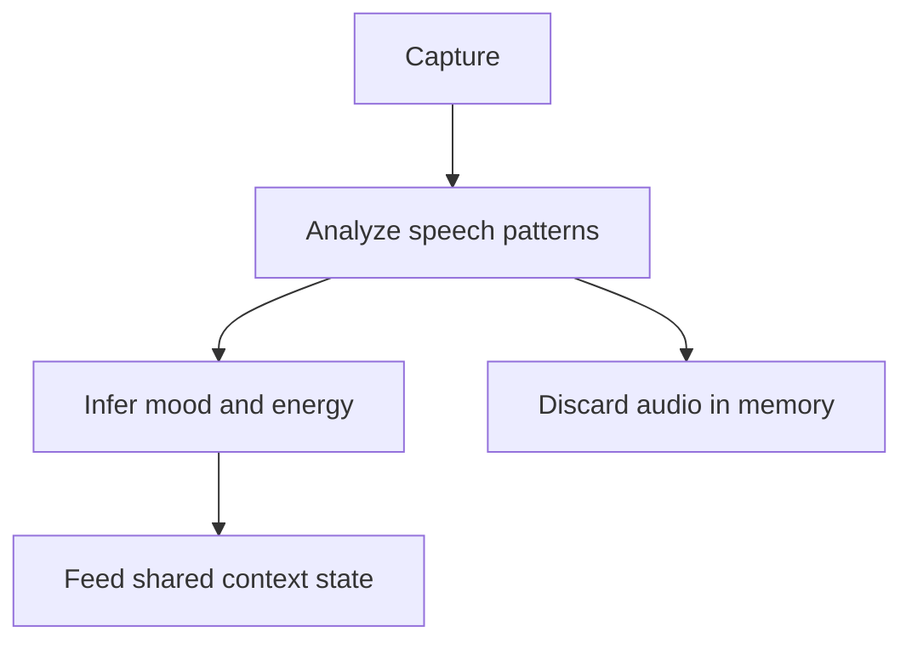

# Mood Inference

Infer mood and energy from speech patterns for shared context and TTS speed.

## Source Mapping

| Source | Reference |
|--------|-----------|
| voice.md | Section 2.1 (Mood Inference from Voice) |
| voice-flow.mermaid | `MOOD` subgraph `M1`–`M4`; parallel from `E` |

## Responsibilities

- Mood and energy are inferred from **speech patterns** — pace, pauses, volume — **not** from transcribed text length.
- Inferences feed into the brain's **shared context state** (`M3` → [specs/brain/context-awareness.md](../brain/context-awareness.md)).
- Audio used for inference is processed **in memory only** and immediately discarded — never written to disk (`M4`).
- Inferences drive speaking speed in [voice-output.md](voice-output.md) (`O1`).

Mermaid flow:

- `M1` Analyze speech patterns (pace, pauses, volume)
- `M2` Infer mood and energy
- `M3` Feed into shared context state
- `M4` Audio processed in memory — immediately discarded

## Inputs / Outputs

| Direction | Content |
|-----------|---------|
| **In** | Raw audio stream during capture |
| **Out** | Mood/energy signals to context state and TTS speed adapter |

## Flow

## Rules and Constraints

- No persistence of inference audio ([privacy.md](privacy.md)).
- Speed adaptation at TTS generation time only ([voice-output.md](voice-output.md)).

## Open Items

_None specific to this component._

## Cross-References

- [voice-input-pipeline.md](voice-input-pipeline.md)
- [voice-output.md](voice-output.md)
- [privacy.md](privacy.md)
- [specs/brain/context-awareness.md](../brain/context-awareness.md)
