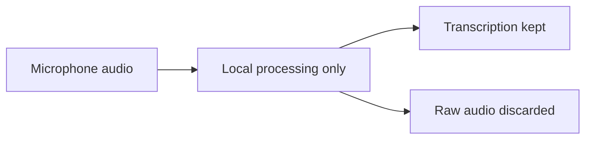

# Privacy

Audio privacy hard rules — local-only processing and no raw audio retention.

## Source Mapping

| Source | Reference |
|--------|-----------|
| voice.md | Section 6 (Audio Privacy — Hard Rule) |
| voice-flow.mermaid | `PRIVACY` subgraph `PR1`–`PR4`; enforced on `INPUT`, `CLONE`, `MOOD` |

## Responsibilities

- **Raw audio is never stored** — only transcriptions are kept (`PR1`)
- Voice samples collected for cloning are stored **locally only** — never uploaded (`PR2`)
- The cloned voice model is stored **locally only** — never shared (`PR3`)
- Audio used for mood inference is processed in memory and **immediately discarded**
- **No audio processing service, cloud API, or external model** is used at any point (`PR4`)

Enforcement:

- `INPUT` subgraph — discard after transcription
- `CLONE` subgraph — local training and storage only
- `MOOD` subgraph — in-memory only

## Inputs / Outputs

| Direction | Content |
|-----------|---------|
| **In** | All microphone and training audio |
| **Out** | Transcriptions and local model files only |

## Flow

## Rules and Constraints

- Aligns with brain privacy ([specs/brain/privacy.md](../brain/privacy.md)).
- Wake word and Whisper must run on-device.

## Open Items

_None specific to this component._

## Cross-References

- [voice-input-pipeline.md](voice-input-pipeline.md)
- [voice-cloning.md](voice-cloning.md)
- [mood-inference.md](mood-inference.md)
