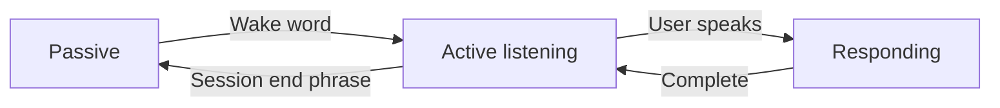

# Session Lifecycle

Passive, active, and responding states from wake word through session end.

## Source Mapping

| Source | Reference |
|--------|-----------|
| voice.md | Section 5 (Session Lifecycle) |
| voice-flow.mermaid | `LIFECYCLE` `LC1`–`LC3`; `H`; `ACK`; `A` |

## Responsibilities

Lifecycle from parent spec:

```
Passive listening (wake word only)
    ↓ Wake word detected
Audio cue plays → C.O.B.R.A. listening
    ↓ User speaks
Whisper transcription → Brain processes → Voice + text response
    ↓ Response complete
C.O.B.R.A. continues listening (no wake word needed)
    ↓ Repeat until...
User says "That's all for now C.O.B.R.A."
    ↓
C.O.B.R.A. acknowledges → Returns to passive listening
```

Mermaid `LIFECYCLE` summary:

- `LC1` Passive — wake word only
- `LC2` Active — continuous listening
- `LC3` Responding — voice and text output
- `LC1` → wake word → `LC2` → user speaks → `LC3` → response complete → `LC2` → session end phrase → `LC1`

After response (`O3`/`O4`), `H` checks session end phrase — if No, continue listening at `E`; if Yes, `ACK` → `A`.

## Inputs / Outputs

| Direction | Content |
|-----------|---------|
| **In** | Wake word, session end phrase, response completion |
| **Out** | State transitions for UI voice indicator |

## Flow



## Rules and Constraints

- No session timeout ([wake-word.md](wake-word.md)).
- Wake word not required again until session ends.

## Open Items

_None specific to this component._

## Cross-References

- [wake-word.md](wake-word.md)
- [voice-input-pipeline.md](voice-input-pipeline.md)
- [voice-output.md](voice-output.md)
- [specs/chat-ui/top-bar.md](../chat-ui/top-bar.md)
