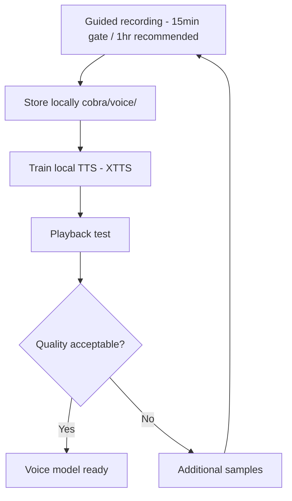

# Voice Cloning

One-time guided recording, local training, and cloned voice model storage.

## Source Mapping

| Source | Reference |
|--------|-----------|
| voice.md | Section 3.1 (Voice Cloning Setup), Section 7 (Voice Cloning Recording Session) |
| voice-flow.mermaid | `CLONE` subgraph `CL1`–`CL7`; `CL6` feeds `O2` |

## Responsibilities

### Setup (§3.1)

- **Minimum enrollment (hard gate):** **15–20 minutes** of guided recordings — enough for a usable XTTS clone to pass first-run onboarding.
- **Recommended quality target:** **1 hour or more** of recorded voice samples (multi-session OK).
- Samples are recorded locally via a **guided recording session**.
- A local TTS model (**Coqui TTS / XTTS or equivalent**) trains on the samples locally (`CL3`).
- Voice samples and the trained model are stored **locally only** — never uploaded or sent externally (`CL2`).
- The cloned voice model is saved to **`~/.cobra/voice/`**.

### Recording session (§7)

1. C.O.B.R.A. presents prompts for the user to read aloud (varied sentences, tone, pacing) (`CL1`)
2. User records at least **15–20 minutes** to pass the first-run gate; **1 hour+** recommended for best quality (multi-session OK)
3. Samples are processed locally to train the cloned voice model (`CL3`)
4. C.O.B.R.A. plays back a test response using the cloned voice for user approval (`CL4`)
5. If clone quality is unsatisfactory, additional recording sessions can improve it (`CL5` → No → `CL7` → `CL1`)
6. The model can be **retrained at any time** with new samples

Mermaid `CLONE` flow:

- `CL5` Quality acceptable? → Yes → `CL6` Voice model ready
- No → `CL7` Record additional samples — retrain → `CL1`

## Inputs / Outputs

| Direction | Content |
|-----------|---------|
| **In** | User voice recordings during guided session |
| **Out** | Trained model at `voice_model_path`; ready for TTS (`O2`) |

## Flow

## Duration Tiers

| Tier | Seconds | Purpose |
|------|---------|---------|
| `minimum_enrollment_seconds` | 900 (15 min) | First-run hard gate — training may proceed |
| `recommended_seconds` | 3600 (1 hr) | Best clone fidelity; encouraged post-gate |

Configuration keys live under `voice:` in config YAML ([configuration.md](configuration.md)).

## Rules and Constraints

- No cloud training or upload ([privacy.md](privacy.md)).
- First-run voice enrollment runs **before** the seed personality interview ([specs/onboarding/first-run-sequence.md](../onboarding/first-run-sequence.md)).
- Missing/corrupt model on startup blocks normal TTS until re-enrollment or restore.

## Open Items

- [ ] Define minimum voice sample quality requirements for cloning (microphone spec, environment)
- [ ] Define behavior if cloned voice model file is missing or corrupted on startup
- [ ] Define whether additional recording sessions append to or replace existing voice samples

## Cross-References

- [voice-output.md](voice-output.md)
- [configuration.md](configuration.md)
- [privacy.md](privacy.md)
- [../platform-support.md](../platform-support.md) — enrollment tiers and install recovery
