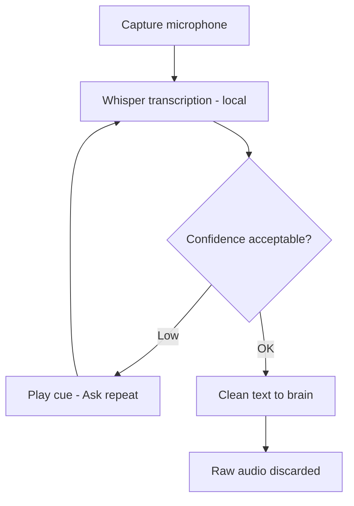

# Voice Input Pipeline

Local capture, Whisper transcription, confidence check, and handoff to the brain.

## Source Mapping

| Source | Reference |
|--------|-----------|
| voice.md | Section 2 (Voice Input Pipeline) |
| voice-flow.mermaid | `INPUT` subgraph `I1`–`I5`; `E` → input |

## Responsibilities

Once activated, all spoken input passes through:

1. **Audio capture** — microphone input captured locally (`E`)
2. **Whisper transcription** — audio converted to text locally via Whisper (`I1`); no cloud
3. **Confidence check** — if transcription confidence is low, C.O.B.R.A. plays the audio cue again and asks the user to repeat (`I2` → `I3` → `I1`)
4. **Clean text output** — transcribed text passed to the brain's Input Mode Layer (`I4` → `BRAIN`)
5. **Audio discarded** — raw audio is never stored, only the transcription is kept (`I5`)

## Inputs / Outputs

| Direction | Content |
|-----------|---------|
| **In** | Microphone audio after wake word |
| **Out** | Clean text to [specs/brain/input-mode-layer.md](../brain/input-mode-layer.md) |

## Flow

## Rules and Constraints

- Whisper runs locally only ([privacy.md](privacy.md)).
- Minimum confidence threshold is undefined (open item).

## Open Items

- [ ] Define minimum acceptable Whisper transcription confidence threshold

## Cross-References

- [wake-word.md](wake-word.md)
- [mood-inference.md](mood-inference.md)
- [privacy.md](privacy.md)
- [specs/brain/input-mode-layer.md](../brain/input-mode-layer.md)
- [../platform-support.md](../platform-support.md) — mic capture and audio deps
